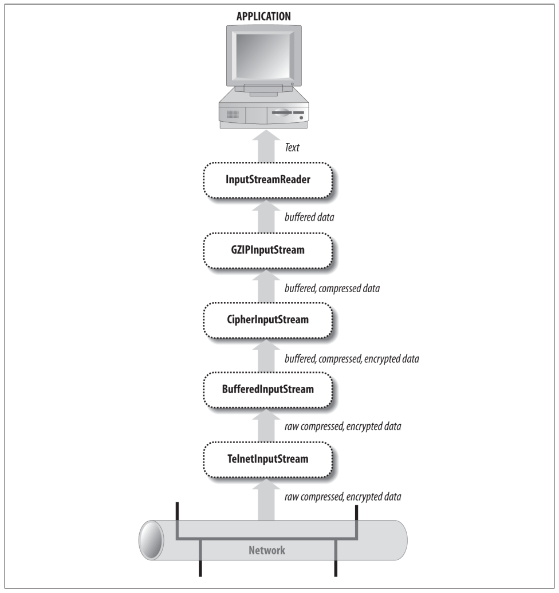

## Chapter 02: Streams

- I/O in Java is built on streams. Input streams read data; output streams write data.

- Filter streams can be chained to either an input stream or an output stream. Filters can modify the data as it’s read or written — for instance, by encrypting or compressing it — or they can simply provide additional methods for converting the data that’s read or written into other formats.

- Readers and writers can be chained to input and output streams to allow programs to read and write text (i.e., characters) rather than bytes. 

- Streams are synchronous; that is, when a program (really a thread) asks a stream to read or write a piece of data, it waits for the data to be read or written before it does anything else. Java also offers nonblocking I/O using channels and buffers.

### Output Streams

- OutputStream’s fundamental method is write(int b). This method takes an integer from 0 to 255 as an argument and writes the corresponding byte to the output stream.

- Take note that although this method takes an int as an argument, it actually writes an unsigned byte. Java doesn’t have an unsigned byte data type, so an int has to be used here instead.

- Most TCP/IP implementations buffer data to some extent. That is, they accumulate bytes in memory and send them to their eventual destination only when a certain number have accumulated or a certain amount of time has passed.

- Streams can also be buffered in software, directly in the Java code as well as in the network hardware. Typically, this is accomplished by chaining a BufferedOutputStream or a BufferedWriter to the underlying stream. Consequently, if you are done writing data, it’s important to flush the output stream.

- You should flush all streams immediately before you close them. Otherwise, data left in the buffer when the stream is closed may get lost.

- When you’re done with a stream, close it by invoking its close() method. This releases any resources associated with the stream, such as file handles or ports.

### Input Streams

- The basic method of InputStream is the noargs read() method. This method reads a single byte of data from the input stream’s source and returns it as an int from 0 to 255. End of stream is signified by returning –1. The read() method waits and blocks execution of any code that follows it until a byte of data is available and ready to be read. Input and output can be slow, so if your program is doing anything else of importance, try to put I/O in its own thread.

- On rare occasions, you may want to skip over data without reading it.

- In order to reread data, mark the current position in the stream with the mark() method. At a later point, you can reset the stream to the marked position using the reset() method.

### Filter Streams

- The filters come in two versions: the filter streams, and the readers and writers. The filter streams still work primarily with raw data as bytes: for instance, by compressing the data or interpreting it as binary numbers. The readers and writers handle the special case of text in a variety of encodings such as UTF-8 and ISO 8859-1.

- The flow of data through a chain of filters  

- Intermixing calls to different streams connected to the same source may violate several implicit contracts of the filter streams. Most of the time, you should only use the last filter in the chain to do the actual reading or writing.

- Under no circumstances should you ever read from or write to anything other than the last filter in the chain.

- The BufferedOutputStream class stores written data in a buffer (a protected byte array field named buf) until the buffer is full or the stream is flushed. Then it writes the data onto the underlying output stream all at once.

- The BufferedInputStream class also has a protected byte array named buf that serves as a buffer. When one of the stream’s read() methods is called, it first tries to get the requested data from the buffer. Only when the buffer runs out of data does the stream read from the underlying source. At this point, it reads as much data as it can from the source into the buffer, whether it needs all the data immediately or not.

- BufferedInputStream does not declare any new methods of its own. It only overrides methods from InputStream. It does support marking and resetting. The two multibyte read() methods attempt to completely fill the specified array or subarray of data by reading from the underlying input stream as many times as necessary. They return only when the array or subarray has been completely filled, the end of stream is reached, or the underlying stream would block on further reads. Most input streams do not behave like this. They read from the underlying stream or data source only once before returning.

- BufferedOutputStream also does not declare any new methods of its own. You invoke its methods exactly as you would in any output stream. The difference is that each write places data in the buffer rather than directly on the underlying output stream. Consequently, it is essential to flush the stream when you reach a point at which the data needs to be sent.

- By default, print streams should be explicitly flushed. However, if the autoFlush argument is true, the stream will be flushed every time a byte array or linefeed is written or a println() method is invoked.

- PrintStream is evil and network programmers should avoid it like the plague!
	- The first problem is that the output from println() is platform dependent. Depending on what system runs your code, lines may sometimes be broken with a linefeed, a carriage return, or a carriage return/linefeed pair.
	- The second problem is that PrintStream assumes the default encoding of the platform on which it’s running. However, this encoding may not be what the server or client expects.
	- The third problem is that PrintStream eats all exceptions. PrintStream catches any exceptions thrown by the underlying output stream.

- The DataInputStream and DataOutputStream classes provide methods for reading and writing Java’s primitive data types and strings in a binary format. The binary formats used are primarily intended for exchanging data between two different Java programs through a network connection, a datafile, a pipe, or some other intermediary. What a data output stream writes, a data input stream can read.

- The writeChars() method simply iterates through the String argument, writing each character in turn as a two-byte, big-endian Unicode character (a UTF-16 code point, to be absolutely precise). The write Bytes() method iterates through the String argument but writes only the least significant byte of each character.

### Readers and Writers

- The java.io.Reader class specifies the API by which characters are read. The java.io.Writer class specifies the API by which characters are written. Wherever input and output streams use bytes, readers and writers use Unicode characters.

- The Writer class mirrors the java.io.OutputStream class. The Reader class mirrors the java.io.InputStream class.

- The InputStreamReader and OutputStreamWriter classes act as decorators on top of input and output streams that change the interface from a byte-oriented interface to a character-oriented interface.