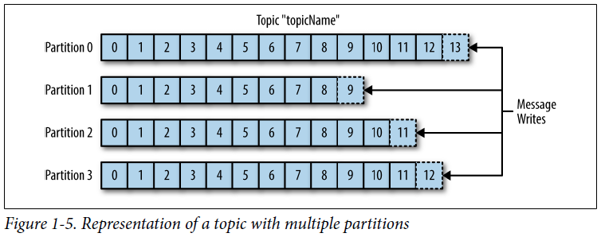
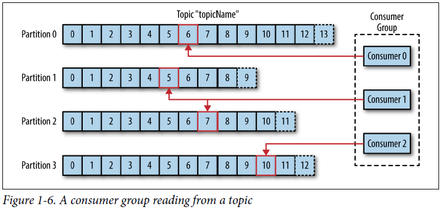
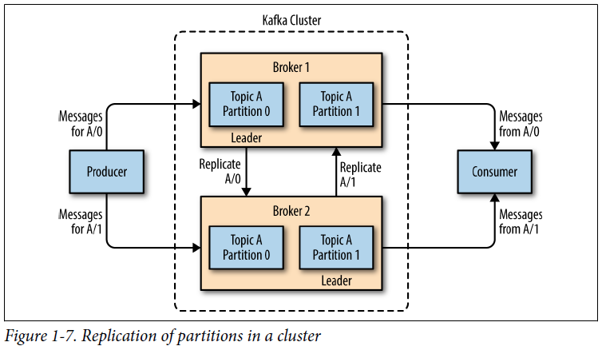
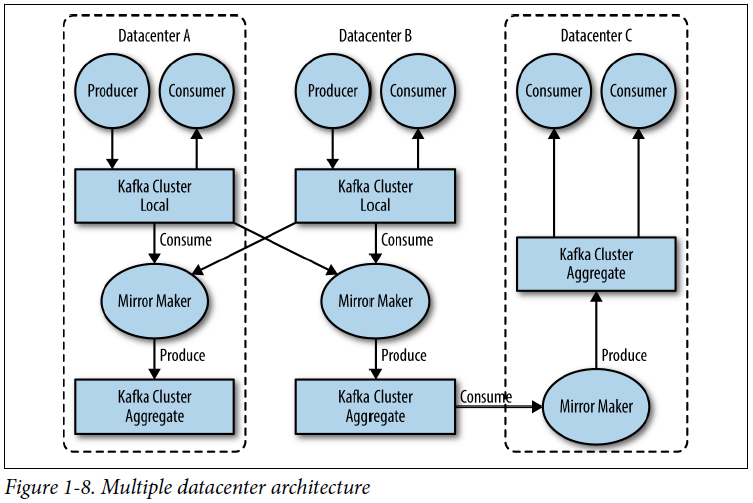

## Chapter 01: Meet Kafka

- Publish/subscribe messaging is a pattern that is characterized by the sender (publisher) of a piece of data (message) not specifically directing it to a receiver. Instead, the publisher classifies the message somehow, and that receiver (subscriber) subscribes to receive certain classes of messages. Pub/sub systems often have a broker, a central point where messages are published, to facilitate this.

- Apache Kafka is a publish/subscribe messaging system designed to solve this problem. It is often described as a “distributed commit log” or more recently as a “distributing streaming platform.” Similarly, data within Kafka is stored durably, in order, and can be read deterministically. In addition, the data can be distributed within the system to provide additional protections against failures, as well as significant opportunities for scaling performance.

- A message is simply an array of bytes as far as Kafka is concerned, so the data contained within it does not have a specific format or meaning to Kafka. A message can have an optional bit of metadata, which is referred to as a key. The key is also a byte array and, as with the message, has no specific meaning to Kafka. Keys are used when messages are to be written to partitions in a more controlled manner.

	For efficiency, messages are written into Kafka in batches. A batch is just a collection of messages, all of which are being produced to the same topic and partition.

- While messages are opaque byte arrays to Kafka itself, it is recommended that additional structure, or schema, be imposed on the message content so that it can be easily understood.

	Many Kafka developers favor the use of Apache Avro, which is a serialization framework originally developed for Hadoop. Avro provides a compact serialization format; schemas that are separate from the message payloads and that do not require code to be generated when they change; and strong data typing and schema evolution, with both backward and forward compatibility.

- Messages in Kafka are categorized into topics. Topics are additionally broken down into a number of partitions. Note that as a topic typically has multiple partitions, there is no guarantee of message time-ordering across the entire topic, just within a single partition.

	The term stream is often used when discussing data within systems like Kafka. Most often, a stream is considered to be a single topic of data, regardless of the number of partitions. This represents a single stream of data moving from the producers to the consumers.

- Kafka clients are users of the system, and there are two basic types: producers and consumers.

	Producers create new messages. In other publish/subscribe systems, these may be called publishers or writers. In general, a message will be produced to a specific topic. By default, the producer does not care what partition a specific message is written to and will balance messages over all partitions of a topic evenly.

	Consumers read messages. In other publish/subscribe systems, these clients may be called subscribers or readers. The consumer subscribes to one or more topics and reads the messages in the order in which they were produced. The consumer keeps track of which messages it has already consumed by keeping track of the offset of messages.

	Consumers work as part of a consumer group, which is one or more consumers that work together to consume a topic. The group assures that each partition is only consumed by one member.

	In this way, consumers can horizontally scale to consume topics with a large number of messages. Additionally, if a single consumer fails, the remaining members of the group will rebalance the partitions being consumed to take over for the missing member.

- Representation of a topic with multiple partitions  
  

- A consumer group reading from a topic  
  

- A single Kafka server is called a broker. The broker receives messages from producers, assigns offsets to them, and commits the messages to storage on disk. It also services consumers, responding to fetch requests for partitions and responding with the messages that have been committed to disk. Depending on the specific hardware and its performance characteristics, a single broker can easily handle thousands of partitions and millions of messages per second.

	Kafka brokers are designed to operate as part of a cluster. Within a cluster of brokers, one broker will also function as the cluster controller (elected automatically from the live members of the cluster). The controller is responsible for administrative operations, including assigning partitions to brokers and monitoring for broker failures. A partition is owned by a single broker in the cluster, and that broker is called the leader of the partition. A partition may be assigned to multiple brokers, which will result in the partition being replicated.

	A key feature of Apache Kafka is that of retention, which is the durable storage of messages for some period of time.

- Replication of partitions in a cluster  
  

- The replication mechanisms within the Kafka clusters are designed only to work within a single cluster, not between multiple clusters.

	The Kafka project includes a tool called MirrorMaker, used for this purpose. At its core, MirrorMaker is simply a Kafka consumer and producer, linked together with a queue. Messages are consumed from one Kafka cluster and produced for another.

- Multiple datacenter architecture  
  

- Why Kafka?
	- Multiple Producers
	- Multiple Consumers
	- Disk-Based Retention
	- Scalable
	- High Performance