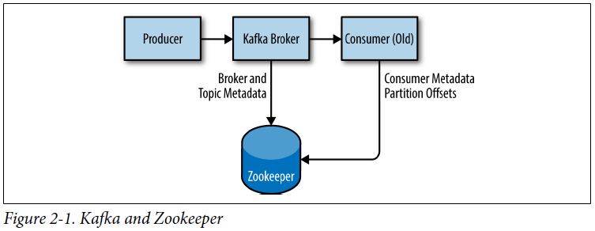
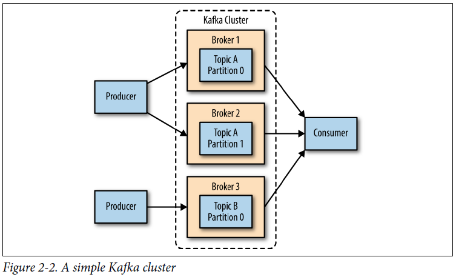

## Chapter 02: Installing Kafka

- Kafka and Zookeeper  
  

- It is generally considered to be good practice to use a chroot path for the Kafka cluster. This allows the Zookeeper ensemble to be shared with other applications, including other Kafka clusters, without a conflict. It is also best to specify multiple Zookeeper servers (which are all part of the same ensemble) in this configuration. This allows the Kafka broker to connect to another member of the Zookeeper ensemble in the event of server failure.

- Kafka persists all messages to disk, and these log segments are stored in the directories specified in the log.dirs configuration. This is a comma-separated list of paths on the local system. If more than one path is specified, the broker will store partitions on them in a “least-used” fashion with one partition’s log segments stored within the same path. Note that the broker will place a new partition in the path that has the least number of partitions currently stored in it.

- By default, only one thread per log directory is used. As these threads are only used during startup and shutdown, it is reasonable to set a larger number of threads in order to parallelize operations. Specifically, when recovering from an unclean shutdown, this can mean the difference of several hours when restarting a broker with a large number of partitions!

- Retention by time is performed by examining the last modified time (mtime) on each log segment file on disk. Under normal cluster operations, this is the time that the log segment was closed, and represents the timestamp of the last message in the file. However, when using administrative tools to move partitions between brokers, this time is not accurate and will result in excess retention for these partitions.

- If you have specified a value for both log.retention.bytes and log.retention.ms (or another parameter for retention by time), messages may be removed when either criteria is met.

- As with the log.retention.bytes and log.retention.ms parameters, log.segment.bytes and log.segment.ms are not mutually exclusive properties. Kafka will close a log segment either when the size limit is reached or when the time limit is reached, whichever comes first.

- When using a time-based log segment limit, it is important to consider the impact on disk performance when multiple log segments are closed simultaneously. This can happen when there are many partitions that never reach the size limit for log segments, as the clock for the time limit will start when the broker starts and will always execute at the same time for these low-volume partitions.

- The message size configured on the Kafka broker must be coordinated with the fetch.message.max.bytes configuration on consumer clients. If this value is smaller than message.max.bytes, then consumers that encounter larger messages will fail to fetch those messages, resulting in a situation where the consumer gets stuck and cannot proceed. The same rule applies to the replica.fetch.max.bytes configuration on the brokers when configured in a cluster.

- The normal mode of operation for a Kafka consumer is reading from the end of the partitions, where the consumer is caught up and lagging behind the producers very little, if at all. In this situation, the messages the consumer is reading are optimally stored in the system’s page cache, resulting in faster reads than if the broker has to reread the messages from disk. Therefore, having more memory available to the system for page cache will improve the performance of consumer clients.

- Ideally, clients should compress messages to optimize network and disk usage. The Kafka broker must decompress all message batches, however, in order to validate the checksum of the individual messages and assign offsets. It then needs to recompress the message batch in order to store it on disk.

- A simple Kafka cluster  
  

- As with most applications—specifically ones where throughput is a concern—it is best to avoid swapping at (almost) all costs. The cost incurred by having pages of memory swapped to disk will show up as a noticeable impact on all aspects of performance in Kafka. In addition, Kafka makes heavy use of the system page cache, and if the VM system is swapping to disk, there is not enough memory being allocated to page cache.

	One way to avoid swapping is just to not configure any swap space at all. Having swap is not a requirement, but it does provide a safety net if something catastrophic happens on the system. Having swap can prevent the OS from abruptly killing a process due to an out-of-memory condition. For this reason, the recommendation is to set the vm.swappiness parameter to a very low value, such as 1. The parameter is a percentage of how likely the VM subsystem is to use swap space rather than dropping pages from the page cache. It is preferable to reduce the size of the page cache rather than swap.

- Regardless of which filesystem is chosen for the mount that holds the log segments, it is advisable to set the noatime mount option for the mount point. File metadata contains three timestamps: creation time (ctime), last modified time (mtime), and last access time (atime). By default, the atime is updated every time a file is read. This generates a large number of disk writes. The atime attribute is generally considered to be of little use, unless an application needs to know if a file has been accessed since it was last modified (in which case the realtime option can be used). The atime is not used by Kafka at all, so disabling it is safe to do. Setting noatime on the mount will prevent these timestamp updates from happening, but will not affect the proper handling of the ctime and mtime attributes.

- In fact, the recommended changes for Kafka are the same as those suggested for most web servers and other networking applications. The first adjustment is to change the default and maximum amount of memory allocated for the send and receive buffers for each socket. This will significantly increase performance for large transfers.