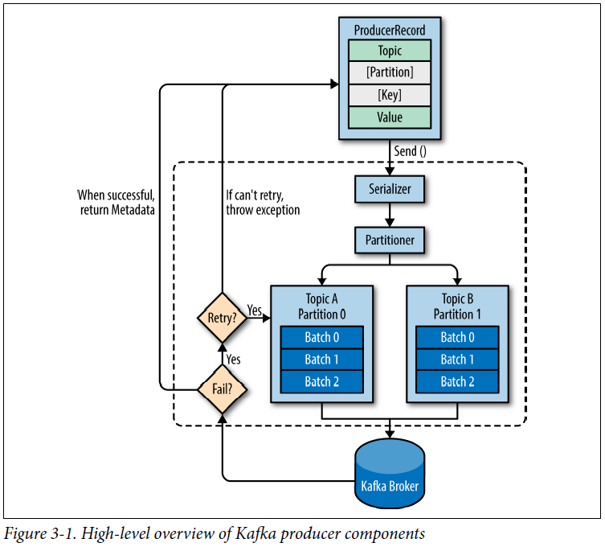
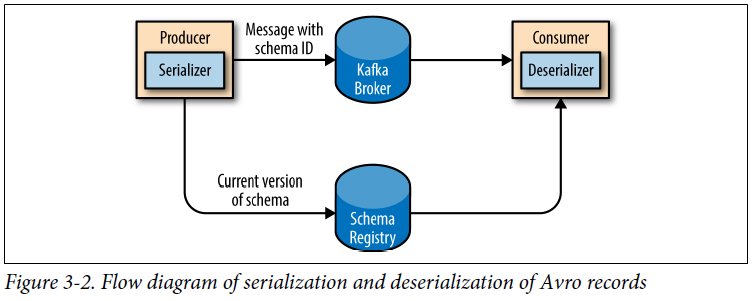

## Chapter 03: Kafka Producers: Writing Messages to Kafka

- High-level overview of Kafka producer components  
  

- We start producing messages to Kafka by creating a ProducerRecord, which must include the topic we want to send the record to and a value. Optionally, we can also specify a key and/or a partition. Once we send the ProducerRecord, the first thing the producer will do is serialize the key and value objects to ByteArrays so they can be sent over the network.

	Next, the data is sent to a partitioner. If we specified a partition in the ProducerRecord, the partitioner doesn’t do anything and simply returns the partition we specified. If we didn’t, the partitioner will choose a partition for us, usually based on the ProducerRecord key. Once a partition is selected, the producer knows which topic and partition the record will go to. It then adds the record to a batch of records that will also be sent to the same topic and partition. A separate thread is responsible for sending those batches of records to the appropriate Kafka brokers.

	When the broker receives the messages, it sends back a response. If the messages were successfully written to Kafka, it will return a RecordMetadata object with the topic, partition, and the offset of the record within the partition. If the broker failed to write the messages, it will return an error. When the producer receives an error, it may retry sending the message a few more times before giving up and returning an error.

- Once we instantiate a producer, it is time to start sending messages. There are three primary methods of sending messages:
	**Fire-and-forget** We send a message to the server and don’t really care if it arrives succesfully or not. Most of the time, it will arrive successfully, since Kafka is highly available and the producer will retry sending messages automatically. However, some messages will get lost using this method.
	**Synchronous send** We send a message, the send() method returns a Future object, and we use get() to wait on the future and see if the send() was successful or not.
	**Asynchronous send** We call the send() method with a callback function, which gets triggered when it receives a response from the Kafka broker.

- KafkaProducer has two types of errors. Retriable errors are those that can be resolved by sending the message again. Some errors will not be resolved by retrying.

- Sending a Message to Kafka
  ```java
  producer.send(record);
  ```

	Sending a Message Synchronously
  ```java
  producer.send(record).get();
  ```

	Sending a Message Asynchronously
  ```java
  private class DemoProducerCallback implements Callback {
    @Override
    public void onCompletion(RecordMetadata recordMetadata, Exception e) {
      if (e != null) {
        e.printStackTrace();
      }
    }
  }

  producer.send(record, new DemoProducerCallback());
  ```

	If Kafka returned an error, onCompletion() will have a nonnull exception.

- Apache Kafka preserves the order of messages within a partition. This means that if messages were sent from the producer in a specific order, the broker will write them to a partition in that order and all consumers will read them in that order.

- A custom serializer:
  ```java
  public class CustomerSerializer implements Serializer<Customer> {
    @Override
    public void configure(Map configs, boolean isKey) {
      // nothing to configure
    }
    @Override
    public byte[] serialize(String topic, Customer data) {
      try {
        ...
        byte[] serializedName = data.getName().getBytes("UTF-8");
        int stringSize = serializedName.length;

        ByteBuffer buffer = ByteBuffer.allocate(4 + 4 + stringSize);
        buffer.putInt(data.getID());
        buffer.putInt(stringSize);
        buffer.put(serializedName);
        return buffer.array();
      } catch (Exception e) {
        throw new SerializationException(...);
      }
    }
    @Override
    public void close() {
      // nothing to close
    }
  }
  ```

- Apache Avro is a language-neutral data serialization format. The project was created by Doug Cutting to provide a way to share data files with a large audience.

	Avro data is described in a language-independent schema. The schema is usually described in JSON and the serialization is usually to binary files, although serializing to JSON is also supported. Avro assumes that the schema is present when reading and writing files, usually by embedding the schema in the files themselves.

	One of the most interesting features of Avro, and what makes it a good fit for use in a messaging system like Kafka, is that when the application that is writing messages switches to a new schema, the applications reading the data can continue processing messages without requiring any change or update.

- Suppose the original schema was:
  ```avro
  {"namespace": "customerManagement.avro",
   "type": "record",
   "name": "Customer",
   "fields": [
     {"name": "id", "type": "int"},
     {"name": "name", "type": "string""},
     {"name": "faxNumber", "type": ["null", "string"], "default": "null"}
   ]
  }
  ```

	The new schema would be:
  ```avro
  {"namespace": "customerManagement.avro",
   "type": "record",
   "name": "Customer",
   "fields": [
     {"name": "id", "type": "int"},
     {"name": "name", "type": "string"},
     {"name": "email", "type": ["null", "string"], "default": "null"}
   ]
  }
  ```

	The reading application will contain calls to methods similar to getName(), getId(), and getFaxNumber. If it encounters a message written with the new schema, getName() and getId() will continue working with no modification, but getFaxNumber() will return null because the message will not contain a fax number.

	Now suppose we upgrade our reading application and it no longer has the getFaxNumber() method but rather getEmail(). If it encounters a message written with the old schema, getEmail() will return null because the older messages do not contain an email address.

	This example illustrates the benefit of using Avro: even though we changed the schema in the messages without changing all the applications reading the data, there will be no exceptions or breaking errors and no need for expensive updates of existing data.

- However, Avro still requires the entire schema to be present when reading the record, so we need to locate the schema elsewhere. To achieve this, we follow a common architecture pattern and use a Schema Registry. The Schema Registry is not part of Apache Kafka but there are several open source options to choose from.

- Flow diagram of serialization and deserialization of Avro records  
  

- Produce generated Avro objects to Kafka:
  ```java
  Properties props = new Properties();
  props.put("bootstrap.servers", "localhost:9092");
  props.put("key.serializer",
      "io.confluent.kafka.serializers.KafkaAvroSerializer");
  props.put("value.serializer",
      "io.confluent.kafka.serializers.KafkaAvroSerializer");
  props.put("schema.registry.url", schemaUrl);

  String topic = "customerContacts";
  int wait = 500;

  Producer<String, Customer> producer =
      new KafkaProducer<String, Customer>(props);

  while (true) {
    Customer customer = CustomerGenerator.getNext();
    ProducerRecord<String, Customer> record =
        new ProducerRecord<>(topic, customer.getId(), customer);
    producer.send(record);
  }
  ```

- Keys serve two goals: they are additional information that gets stored with the message, and they are also used to decide which one of the topic partitions the message will be written to. All messages with the same key will go to the same partition.

	When the key is null and the default partitioner is used, the record will be sent to one of the available partitions of the topic at random. A round-robin algorithm will be used to balance the messages among the partitions.

	If a key exists and the default partitioner is used, Kafka will hash the key (using its own hash algorithm, so hash values will not change when Java is upgraded), and use the result to map the message to a specific partition.

	The mapping of keys to partitions is consistent only as long as the number of partitions in a topic does not change.

- A custom partitioner:
  ```java
  public class BananaPartitioner implements Partitioner {
    public void configure(Map<String, ?> configs) {}
    public int partition(String topic, Object key, byte[] keyBytes,
        Object value, byte[] valueBytes, Cluster cluster) {
      List<PartitionInfo> partitions = cluster.partitionsForTopic(topic);
      int numPartitions = partitions.size();
      if ((keyBytes == null) || (!(key instanceOf String)))
        throw new InvalidRecordException("...")
      if (((String) key).equals("Banana"))
        return numPartitions; // Banana will always go to last partition
      return (Math.abs(Utils.murmur2(keyBytes)) % (numPartitions - 1))
    }
    public void close() {}
  }
  ```