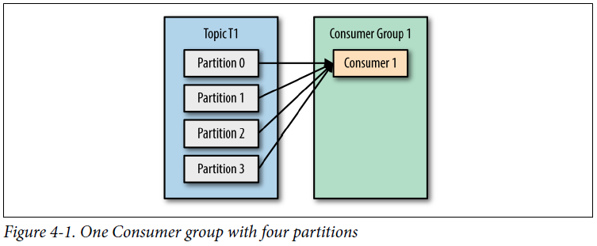
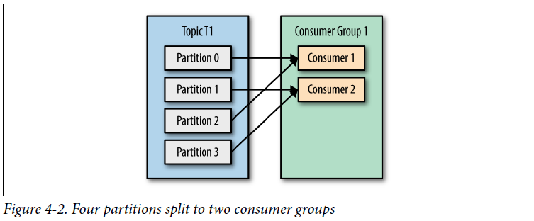
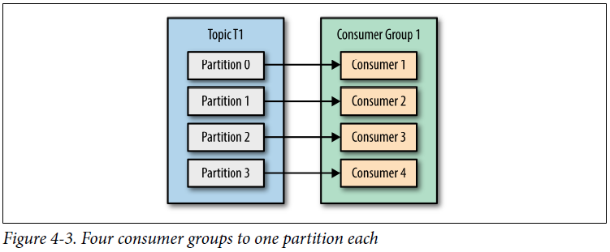
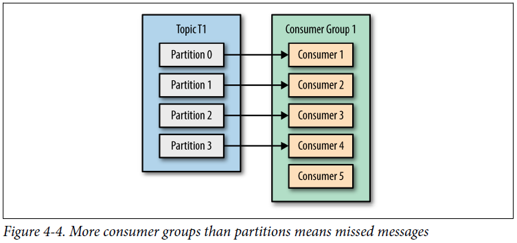
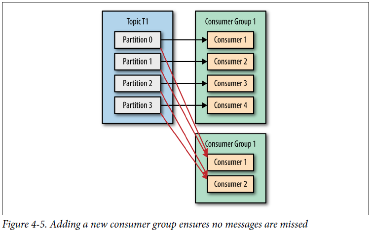
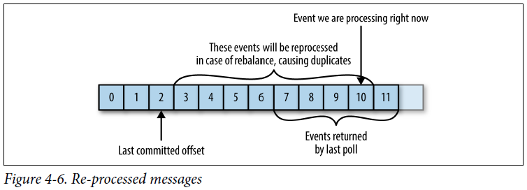
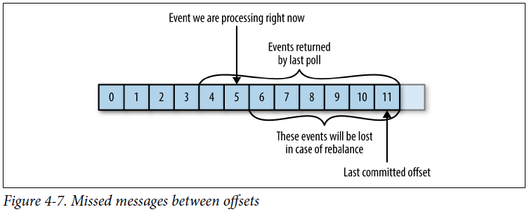

## Chapter 04: Kafka Consumers: Reading Data from Kafka

- Kafka consumers are typically part of a consumer group. When multiple consumers are subscribed to a topic and belong to the same consumer group, each consumer in the group will receive messages from a different subset of the partitions in the topic.

	Keep in mind that there is no point in adding more consumers than you have partitions in a topic—some of the consumers will just be idle.

- One Consumer group with four partitions  
  

- Four partitions split to two consumer groups  
  

- Four consumer groups to one partition each  
  

- More consumer groups than partitions means missed messages  
  

- Adding a new consumer group ensures no messages are missed  
  

- Moving partition ownership from one consumer to another is called a rebalance. Rebalances are important because they provide the consumer group with high availability and scalability (allowing us to easily and safely add and remove consumers), but in the normal course of events they are fairly undesirable. During a rebalance, consumers can’t consume messages, so a rebalance is basically a short window of unavailability of the entire consumer group. In addition, when partitions are moved from one consumer to another, the consumer loses its current state; if it was caching any data, it will need to refresh its caches—slowing down the application until the consumer sets up its state again.

	The way consumers maintain membership in a consumer group and ownership of the partitions assigned to them is by sending heartbeats to a Kafka broker designated as the group coordinator (this broker can be different for different consumer groups).

- When a consumer wants to join a group, it sends a JoinGroup request to the group coordinator. The first consumer to join the group becomes the group leader. The leader receives a list of all consumers in the group from the group coordinator (this will include all consumers that sent a heartbeat recently and which are therefore considered alive) and is responsible for assigning a subset of partitions to each consumer. It uses an implementation of PartitionAssignor to decide which partitions should be handled by which consumer.

- Once we create a consumer, the next step is to subscribe to one or more topics. The subcribe() method takes a list of topics as a parameter, so it’s pretty simple to use:
  ```java
  consumer.subscribe(Collections.singletonList("customerCountries"));
  ```

	At the heart of the consumer API is a simple loop for polling the server for more data. Once the consumer subscribes to topics, the poll loop handles all details of coordination, partition rebalances, heartbeats, and data fetching, leaving the developer with a clean API that simply returns available data from the assigned partitions. The main body of a consumer will look as follows:
  ```java
  try {
    while (true) {
      ConsumerRecords<String, String> records = consumer.poll(100);
      for (ConsumerRecord<String, String> record : records) {
        ...
      }
    }
  } finally {
    consumer.close();
  }
  ```

- You can’t have multiple consumers that belong to the same group in one thread and you can’t have multiple threads safely use the same consumer. One consumer per thread is the rule.

- By default, Kafka has two assignment strategies:
	- Range
		- Assigns to each consumer a consecutive subset of partitions from each topic it subscribes to.
	- RoundRobin
		- Takes all the partitions from all subscribed topics and assigns them to consumers sequentially, one by one.

- Whenever we call poll(), it returns records written to Kafka that consumers in our group have not read yet. This means that we have a way of tracking which records were read by a consumer of the group.

	We call the action of updating the current position in the partition a commit.

	How does a consumer commit an offset? It produces a message to Kafka, to a special_consumer_offsets topic, with the committed offset for each partition.

- Figure 4-6. Re-processed messages  
  

- Figure 4-7. Missed messages between offsets  
  

- With autocommit enabled, a call to poll will always commit the last offset returned by the previous poll. It doesn’t know which events were actually processed, so it is critical to always process all the events returned by poll() before calling poll() again. (Just like poll(), close() also commits offsets automatically.)

- The simplest and most reliable of the commit APIs is commitSync(). This API will commit the latest offset returned by poll() and return once the offset is committed, throwing an exception if commit fails for some reason.

	It is important to remember that commitSync() will commit the latest offset returned by poll(), so make sure you call commitSync() after you are done processing all the records in the collection, or you risk missing messages as described previously.

	Another option is the asynchronous commit API. Instead of waiting for the broker to respond to a commit, we just send the request and continue on.

	We mention this complication and the importance of correct order of commits, because commitAsync() also gives you an option to pass in a callback that will be triggered when the broker responds. It is common to use the callback to log commit errors or to count them in a metric, but if you want to use the callback for retries, you need to be aware of the problem with commit order.

- Normally, occasional failures to commit without retrying are not a huge problem because if the problem is temporary, the following commit will be successful. But if we know that this is the last commit before we close the consumer, or before a rebalance, we want to make extra sure that the commit succeeds.

- Fortunately, the consumer API allows you to call commitSync() and commitAsync() and pass a map of partitions and offsets that you wish to commit. If you are in the middle of processing a batch of records, and the last message you got from partition 3 in topic “customers” has offset 5000, you can call commitSync() to commit offset 5000 for partition 3 in topic “customers.” Since your consumer may be consuming more than a single partition, you will need to track offsets on all of them, which adds complexity to your code.

- The consumer API allows you to run your own code when partitions are added or removed from the consumer. You do this by passing a ConsumerRebalanceListener when calling the subscribe() method we discussed previously. ConsumerRebalance Listener has two methods you can implement:
	- `public void onPartitionsRevoked(Collection<TopicPartition> partitions)`
		- Called before the rebalancing starts and after the consumer stopped consuming messages. This is where you want to commit offsets, so whoever gets this partition next will know where to start.
	- `public void onPartitionsAssigned(Collection<TopicPartition> partitions)`
		- Called after partitions have been reassigned to the broker, but before the consumer starts consuming messages.

- If you want to start reading all messages from the beginning of the partition, or you want to skip all the way to the end of the partition and start consuming only new messages, there are APIs specifically for that: seekToBeginning(TopicPartition tp) and seekToEnd(TopicPartition tp).

	However, the Kafka API also lets you seek a specific offset. This ability can be used in a variety of ways; for example, to go back a few messages or skip ahead a few messages (perhaps a time-sensitive application that is falling behind will want to skip ahead to more relevant messages). The most exciting use case for this ability is when offsets are stored in a system other than Kafka.

- When you decide to exit the poll loop, you will need another thread to call consumer.wakeup(). If you are running the consumer loop in the main thread, this can be done from ShutdownHook. Note that consumer.wakeup() is the only consumer method that is safe to call from a different thread. Calling wakeup will cause poll() to exit with WakeupException, or if consumer.wakeup() was called while the thread was not waiting on poll, the exception will be thrown on the next iteration when poll() is called.
  ```java
  Runtime.getRuntime().addShutdownHook(new Thread() {
    public void run() {
      consumer.wakeup();
      try {
        mainThread.join();
      } catch (InterruptedException e) {
        e.printStackTrace();
      }
    }
  });
  ```

- The custom deserializer:
  ```java
  public class CustomerDeserializer implements Deserializer<Customer> {
    @Override
    public void configure(Map configs, boolean isKey) {
      // nothing to configure
    }
    @Override
    public Customer deserialize(String topic, byte[] data) {
      ...
      ByteBuffer buffer = ByteBuffer.wrap(data);
      int id = buffer.getInt();
      int nameSize = buffer.getInt();
      byte[] nameBytes = new Array[Byte](nameSize);
      buffer.get(nameBytes);
      String name = new String(nameBytes, 'UTF-8');
      return new Customer(id, name);
    }
    @Override
    public void close() {
      // nothing to close
    }
  }
  ```

- Again, it is important to note that implementing a custom serializer and deserializer is not recommended. It tightly couples producers and consumers and is fragile and error-prone. A better solution would be to use a standard message format such as JSON, Thrift, Protobuf, or Avro.

- A consumer can assign itself all partitions of a specific topic and consume from them:
  ```java
  List<PartitionInfo> partitionInfos = consumer.partitionsFor("topic");
  for (PartitionInfo partition : partitionInfos) {
    partitions.add(new TopicPartition(partition.topic(),
        partition.partition()));
  }
  consumer.assign(partitions);
  while (true) {
    ConsumerRecords<String, String> records = consumer.poll(1000);
    for (ConsumerRecord<String, String> record: records) {
      ...
    }
    consumer.commitSync();
  }
  ```