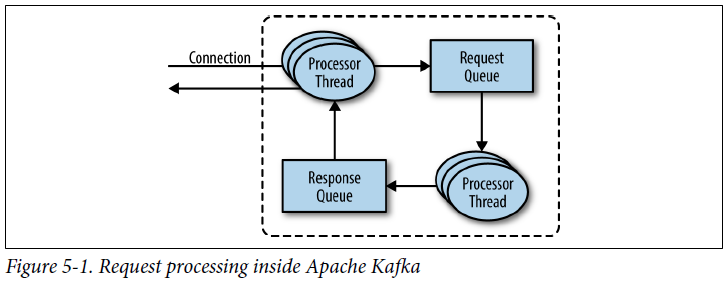
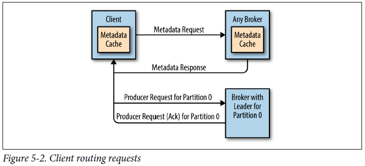
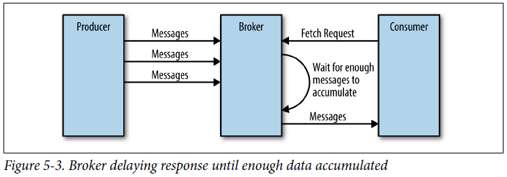
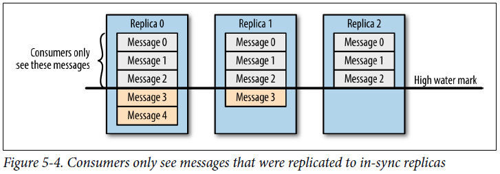
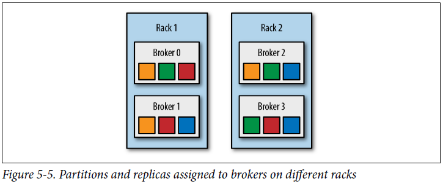
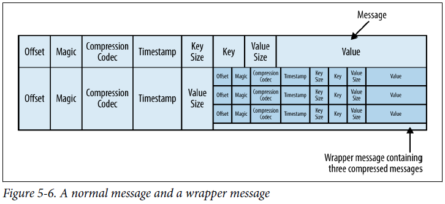
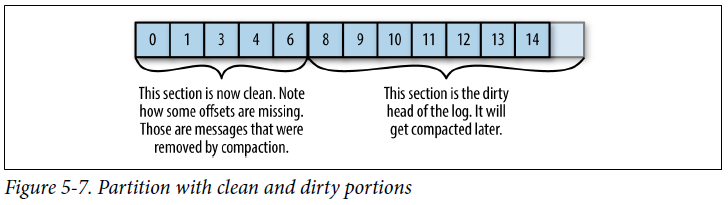
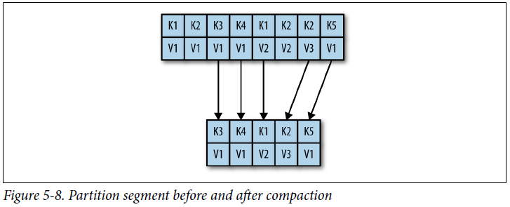

## Chapter 05: Kafka Internals

- Kafka uses Apache Zookeeper to maintain the list of brokers that are currently members of a cluster. Every broker has a unique identifier that is either set in the broker configuration file or automatically generated. Every time a broker process starts, it registers itself with its ID in Zookeeper by creating an ephemeral node. Different Kafka components subscribe to the /brokers/ids path in Zookeeper where brokers are registered so they get notified when brokers are added or removed.

- To summarize, Kafka uses Zookeeper’s ephemeral node feature to elect a controller and to notify the controller when nodes join and leave the cluster. The controller is responsible for electing leaders among the partitions and replicas whenever it notices nodes join and leave the cluster. The controller uses the epoch number to prevent a “split brain” scenario where two nodes believe each is the current controller.

- There are two types of replicas:
	- Leader replica
		- Each partition has a single replica designated as the leader. All produce and consume requests go through the leader, in order to guarantee consistency.
	- Follower replica
		- All replicas for a partition that are not leaders are called followers. Followers don’t serve client requests; their only job is to replicate messages from the leader and stay up-to-date with the most recent messages the leader has. In the event that a leader replica for a partition crashes, one of the follower replicas will be promoted to become the new leader for the partition.

- A replica will request message 1, then message 2, and then message 3, and it will not request message 4 before it gets all the previous messages. This means that the leader can know that a replica got all messages up to message 3 when the replica requests message 4. By looking at the last offset requested by each replica, the leader can tell how far behind each replica is. If a replica hasn’t requested a message in more than 10 seconds or if it has requested messages but hasn’t caught up to the most recent message in more than 10 seconds, the replica is considered out of sync. If a replica fails to keep up with the leader, it can no longer become the new leader in the event of failure—after all, it does not contain all the messages.

	In addition to the current leader, each partition has a preferred leader—the replica that was the leader when the topic was originally created. It is preferred because when partitions are first created, the leaders are balanced between brokers (we explain the algorithm for distributing replicas and leaders among brokers later in the chapter). As a result, we expect that when the preferred leader is indeed the leader for all partitions in the cluster, load will be evenly balanced between brokers. By default, Kafka is configured with auto.leader.rebalance.enable=true, which will check if the preferred leader replica is not the current leader but is in-sync and trigger leader election to make the preferred leader the current leader.

- For each port the broker listens on, the broker runs an acceptor thread that creates a connection and hands it over to a processor thread for handling. The number of processor threads (also called network threads) is configurable. The network threads are responsible for taking requests from client connections, placing them in a request queue, and picking up responses from a response queue and sending them back to clients.

	Once requests are placed on the request queue, IO threads are responsible for picking them up and processing them. The most common types of requests are:
	- Produce requests
		- Sent by producers and contain messages the clients write to Kafka brokers.
	- Fetch requests
		- Sent by consumers and follower replicas when they read messages from Kafka brokers.

- Request processing inside Apache Kafka  
  

- How do the clients know where to send the requests? Kafka clients use another request type called a metadata request, which includes a list of topics the client is interested in. The server response specifies which partitions exist in the topics, the replicas for each partition, and which replica is the leader. Metadata requests can be sent to any broker because all brokers have a metadata cache that contains this information.

- Client routing requests  
  

- If the offset exists, the broker will read messages from the partition, up to the limit set by the client in the request, and send the messages to the client. Kafka famously uses a zero-copy method to send the messages to the clients—this means that Kafka sends messages from the file (or more likely, the Linux filesystem cache) directly to the network channel without any intermediate buffers. This is different than most databases where data is stored in a local cache before being sent to clients. This technique removes the overhead of copying bytes and managing buffers in memory, and results in much improved performance.

- Broker delaying response until enough data accumulated  
  

- It is also interesting to note that not all the data that exists on the leader of the partition is available for clients to read. Most clients can only read messages that were written to all in-sync replicas (follower replicas, even though they are consumers, are exempt from this—otherwise replication would not work). We already discussed that the leader of the partition knows which messages were replicated to which replica, and until a message was written to all in-sync replicas, it will not be sent to consumers—attempts to fetch those messages will result in an empty response rather than an error.

- Consumers only see messages that were replicated to in-sync replicas  
  

- Partitions and replicas assigned to brokers on different racks  
  

- Each segment is stored in a single data file. Inside the file, we store Kafka messages and their offsets. The format of the data on the disk is identical to the format of the messages that we send from the producer to the broker and later from the broker to the consumers. Using the same message format on disk and over the wire is what allows Kafka to use zero-copy optimization when sending messages to consumers and also avoid decompressing and recompressing messages that the producer already compressed.

	Each message contains—in addition to its key, value, and offset—things like the message size, checksum code that allows us to detect corruption, magic byte that indicates the version of the message format, compression codec (Snappy, GZip, or LZ4), and a timestamp (added in release 0.10.0). The timestamp is given either by the producer when the message was sent or by the broker when the message arrived—depending on configuration.

- A normal message and a wrapper message  
  

- In order to help brokers quickly locate the message for a given offset, Kafka maintains an index for each partition. The index maps offsets to segment files and positions within the file.

- Kafka supports such use cases by allowing the retention policy on a topic to be delete, which deletes events older than retention time, to compact, which only stores the most recent value for each key in the topic. Obviously, setting the policy to compact only makes sense on topics for which applications produce events that contain both a key and a value. If the topic contains null keys, compaction will fail.

- Each log is viewed as split into two portions (see Figure 5-7):
	- Clean
		- Messages that have been compacted before. This section contains only one value for each key, which is the latest value at the time of the pervious compaction
	- Dirty
		- Messages that were written after the last compaction.

- Partition with clean and dirty portions  
  

- If compaction is enabled when Kafka starts (using the awkwardly named log.cleaner.enabled configuration), each broker will start a compaction manager thread and a number of compaction threads. These are responsible for performing the compaction tasks. Each of these threads chooses the partition with the highest ratio of dirty messages to total partition size and cleans this partition.

	To compact a partition, the cleaner thread reads the dirty section of the partition and creates an in-memory map. Each map entry is comprised of a 16-byte hash of a message key and the 8-byte offset of the previous message that had this same key. This means each map entry only uses 24 bytes.

	Once the cleaner thread builds the offset map, it will start reading off the clean segments, starting with the oldest, and check their contents against the offset map. For each message it checks, if the key of the message exists in the offset map. If the key does not exist in the map, the value of the message we’ve just read is still the latest and we copy over the message to a replacement segment. If the key does exist in the map, we omit the message because there is a message with an identical key but newer value later in the partition.

- Partition segment before and after compaction  
  

- If we always keep the latest message for each key, what do we do when we really want to delete all messages for a specific key, such as if a user left our service and we are legally obligated to remove all traces of that user from our system?

	In order to delete a key from the system completely, not even saving the last message, the application must produce a message that contains that key and a null value. When the cleaner thread finds such a message, it will first do a normal compaction and retain only the message with the null value. It will keep this special message (known as a tombstone) around for a configurable amount of time. During this time, consumers will be able to see this message and know that the value is deleted. So if a consumer copies data from Kafka to a relational database, it will see the tombstone message and know to delete the user from the database. After this set amount of time, the cleaner thread will remove the tombstone message, and the key will be gone from the partition in Kafka. It is important to give consumers enough time to see the tombstone message, because if our consumer was down for a few hours and missed the tombstone message, it will simply not see the key when consuming and therefore not know that it was deleted from Kafka or to delete it from the database.