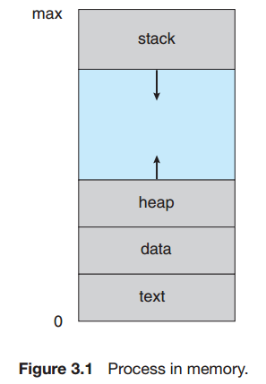
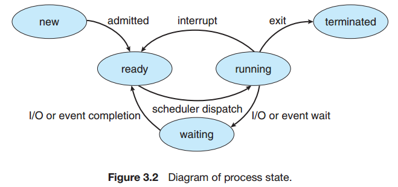
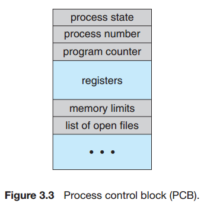
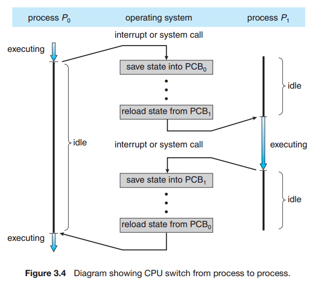
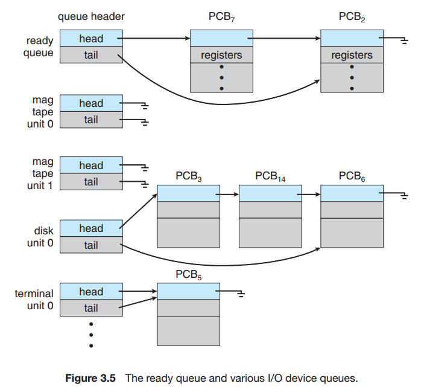
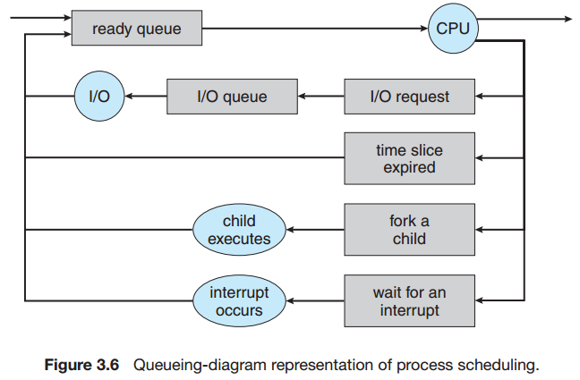
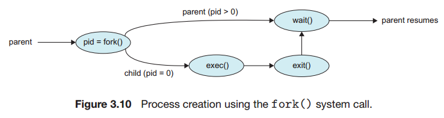
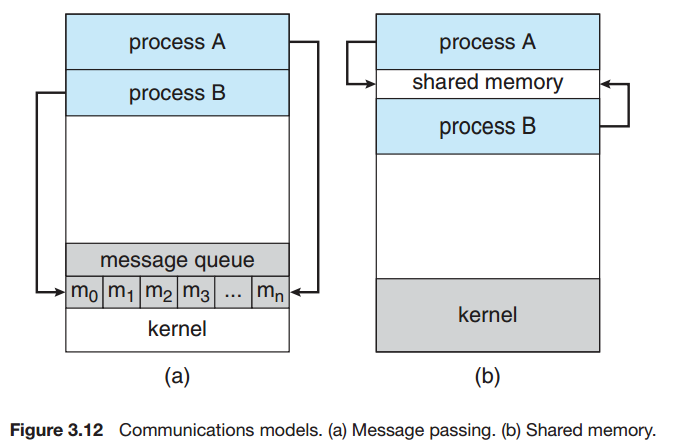

## Chapter 03: Processes

### 3.1 Process Concept

- Process in memory  
  

- Process state  
  

- Process control block (PCB)  
  

- CPU switch  
  

### 3.2 Process Scheduling

- Ready queue  
  

- Process scheduling  
  

- The long-term scheduler, or job scheduler, selects processes from this pool and loads them into memory for execution. The short-term scheduler, or CPU scheduler, selects from among the processes that are ready to execute and allocates the CPU to one of them.

- Some operating systems, such as time-sharing systems, may introduce an additional, intermediate level of scheduling. The key idea behind a medium-term scheduler is
that sometimes it can be advantageous to remove a process from memory (and from active contention for the CPU) and thus reduce the degree of multiprogramming. Later, the process can be reintroduced into memory, and its execution can be continued where it left off. This scheme is called swapping.

### 3.3 Operations on Processes

- Process creation  
  

### 3.4 Interprocess Communication

- Cooperating processes require an interprocess communication (IPC) mechanism that will allow them to exchange data and information. There are two fundamental models of interprocess communication: shared memory and message passing. In the shared-memory model, a region of memory that is shared by cooperating processes is established. Processes can then exchange information by reading and writing data to the shared region. In the message-passing model, communication takes place by means of messages exchanged between the cooperating processes.

- Communication models  
  

### 3.5 Examples of IPC Systems

### 3.6 Communication in Client-Server Systems

- **TODO PIPE**