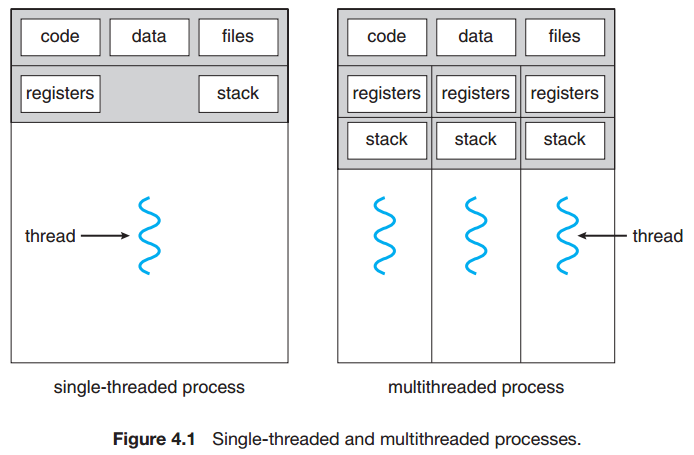
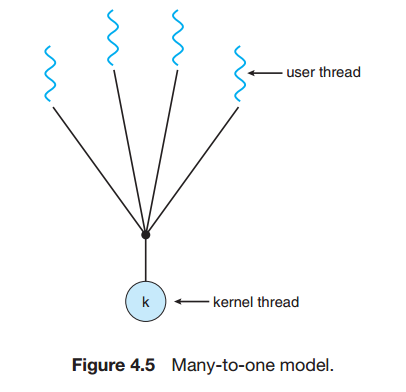
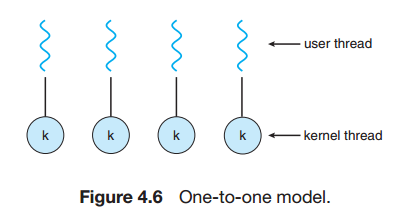
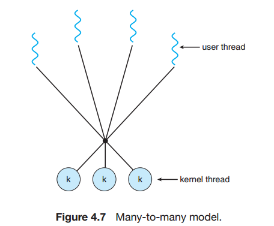

## Chapter 04: Threads

### 4.1 Overview

### 4.2 Multicore Programming

### 4.3 Multithreading Models

- Threads  
  

- Multithreading Models  
  
  
  

### 4.4 Thread Libraries

### 4.5 Implicit Threading

- The general idea behind a thread pool is to create a number of threads at process startup and place them into a pool, where they sit and wait for work. When a server receives a request, it awakens a thread from this pool—if one is available—and passes it the request for service. Once the thread completes its service, it returns to the pool and awaits more work. If the pool contains no available thread, the server waits until one becomes free.

- Thread pools offer these benefits:
	- Servicing a request with an existing thread is faster than waiting to create a thread.
	- A thread pool limits the number of threads that exist at any one point. This is particularly important on systems that cannot support a large number of concurrent threads.
	- Separating the task to be performed from the mechanics of creating the task allows us to use different strategies for running the task. For example, the task could be scheduled to execute after a time delay or to execute periodically.

### 4.6 Threading Issues

- A thread that is to be canceled is often referred to as the target thread. Cancellation of a target thread may occur in two different scenarios:
	- Asynchronous cancellation. One thread immediately terminates the target thread.
	- Deferred cancellation. The target thread periodically checks whether it should terminate, allowing it an opportunity to terminate itself in an orderly fashion.

- The difficulty with cancellation occurs in situations where resources have been allocated to a canceled thread or where a thread is canceled while in the midst of updating data it is sharing with other threads. This becomes especially troublesome with asynchronous cancellation. Often, the operating system will reclaim system resources from a canceled thread but will not reclaim all resources. Therefore, canceling a thread asynchronously may not free a necessary system-wide resource.  
With deferred cancellation, in contrast, one thread indicates that a target thread is to be canceled, but cancellation occurs only after the target thread has checked a flag to determine whether or not it should be canceled. The thread can perform this check at a point at which it can be canceled safely.

### 4.7 Operating-System Examples