## Chapter 05: Process Synchronization

### 5.1 Background

- General structure of a typical process  
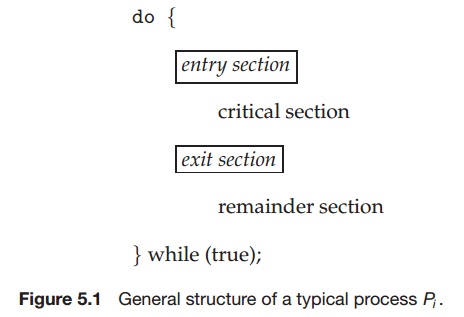  

### 5.2 The Critical-Section Problem

- A solution to the critical-section problem must satisfy the following three requirements:
	- Mutual exclusion.
	- Progress.
	- Bounded waiting.

### 5.3 Peterson's Solution

- Perterson's solution  
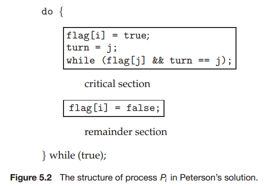  

### 5.4 Synchronization Hardware

- test and set  
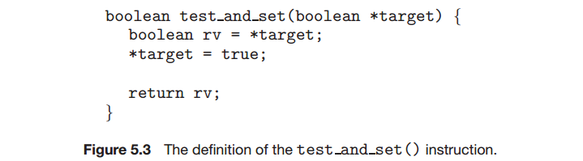  
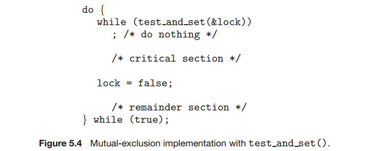  

- compare and swap  
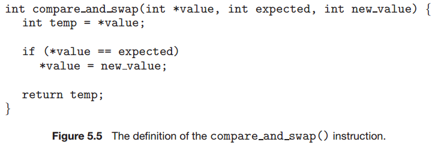  
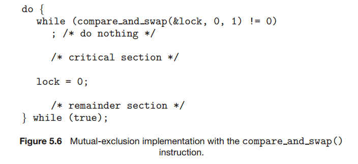  

### 5.5 Mutex Locks

### 5.6 Semaphores

- Semaphore  
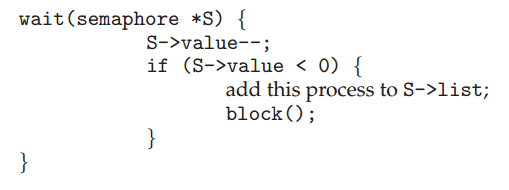  
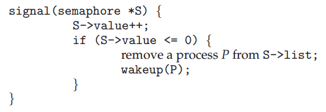  

### 5.7 Classic Problems of Synchronization

- Bounded-Buffer Problem  
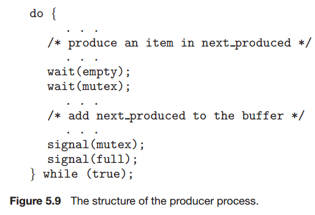  
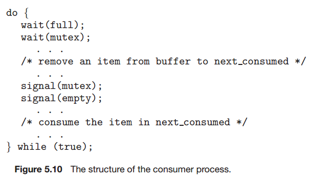  

- Readers-Writers Problem  
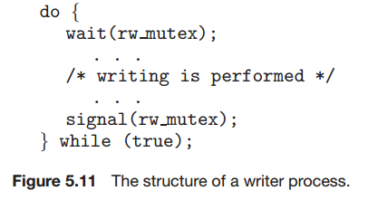  
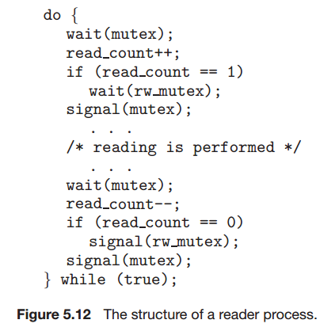  

### 5.8 Monitors

- **TODO MONITOR**

### 5.9 Synchronization Examples

### 5.10 Alternative Approaches
