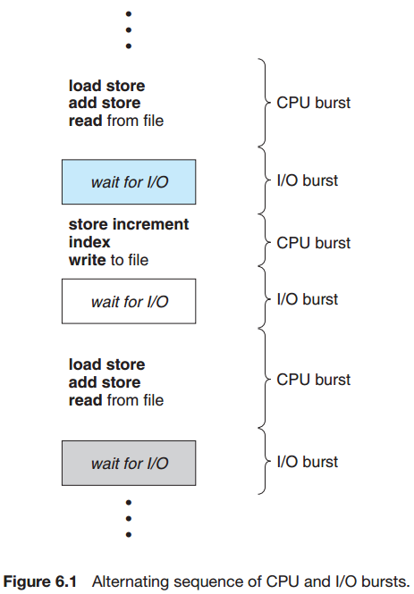

## Chapter 06: CPU Scheduling

### 6.1 Basic Concepts

- The success of CPU scheduling depends on an observed property of processes: process execution consists of a cycle of CPU execution and I/O wait. Processes alternate between these two states. Process execution begins with a CPU burst. That is followed by an I/O burst, which is followed by another CPU burst, then another I/O burst, and so on. Eventually, the final CPU burst ends with a system request to terminate execution.

- CPU-I/O burst cycle  
  

- Preemptive scheduling can result in race conditions when data are shared among several processes. Consider the case of two processes that share data. While one process is updating the data, it is preempted so that the second process can run. The second process then tries to read the data, which are in an inconsistent state.

### 6.2 Scheduling Criteria

- The criteria include the following:
	- CPU utilization. We want to keep the CPU as busy as possible. 
	- Throughput. If the CPU is busy executing processes, then work is being done.
	- Turnaround time. From the point of view of a particular process, the important criterion is how long it takes to execute that process.
	- Waiting time. The CPU-scheduling algorithm does not affect the amount of time during which a process executes or does I/O.
	- Response time. Another measure is the time from the submission of a request until the first response is produced. This measure, called response time, is the time it takes to start responding, not the time it takes to output the response.

### 6.3 Scheduling Algorithms

- CPU scheduling deals with the problem of deciding which of the processes in the ready queue is to be allocated the CPU. There are many different CPU-scheduling algorithms.
	- By far the simplest CPU-scheduling algorithm is the first-come, first-served (FCFS) scheduling algorithm. With this scheme, the process that requests the CPU first is allocated the CPU first.
	- A different approach to CPU scheduling is the shortest-job-first (SJF) scheduling algorithm. This algorithm associates with each process the length of the process’s next CPU burst. When the CPU is available, it is assigned to the process that has the smallest next CPU burst.
	- The SJF algorithm is a special case of the general priority-scheduling algorithm. A priority is associated with each process, and the CPUis allocated to the process with the highest priority. Equal-priority processes are scheduled in FCFS order.
	- The round-robin (RR) scheduling algorithm is designed especially for timesharing systems. It is similar to FCFS scheduling, but preemption is added to enable the system to switch between processes.
	- Another class of scheduling algorithms has been created for situations in which processes are easily classified into different groups. A multilevel queue scheduling algorithm partitions the ready queue into several separate queues. Each queue has its own scheduling algorithm.
	- The multilevel feedback queue scheduling algorithm, in contrast, allows a process to move between queues. The idea is to separate processes according to the characteristics of their CPU bursts. 

- The real difficulty with the SJF algorithm is knowing the length of the next CPU request. The next CPU burst is generally predicted as an exponential average of the measured lengths of previous CPU bursts.

- The SJF algorithm can be either preemptive or nonpreemptive. The choice arises when a new process arrives at the ready queue while a previous process is still executing. The next CPU burst of the newly arrived process may be shorter than what is left of the currently executing process. A preemptive SJF algorithm will preempt the currently executing process, whereas a nonpreemptive SJF
algorithm will allow the currently running process to finish its CPU burst. Preemptive SJF scheduling is sometimes called shortest-remaining-time-first scheduling.

- A major problem with priority scheduling algorithms is indefinite blocking, or starvation. A solution to the problem of indefinite blockage of low-priority processes is aging.

### 6.4 Thread Scheduling

### 6.5 Multiple-Processor Scheduling

- Now consider what happens if the process migrates to another processor. The contents of cache memory must be invalidated for the first processor, and the cache for the second processor must be repopulated. Because of the high cost of invalidating and repopulating caches, most SMP systems try to avoid migration of processes from one processor to another and instead attempt to keep a process running on the same processor. This is known as processor affinity—that is, a process has an affinity for the processor on which it is currently running.

There are two general approaches to load balancing: push migration and pull migration. With push migration, a specific task periodically checks the load on each processor and—if it finds an imbalance—evenly distributes the load by moving (or pushing) processes from overloaded to idle or less-busy processors. Pull migration occurs when an idle processor pulls a waiting task from a busy processor. Push and pull migration need not be mutually exclusive and are in fact often implemented in parallel on load-balancing systems.

### 6.6 Real-Time CPU Scheduling

### 6.7 Operating-System Examples

### 6.8 Algorithm Evaluation