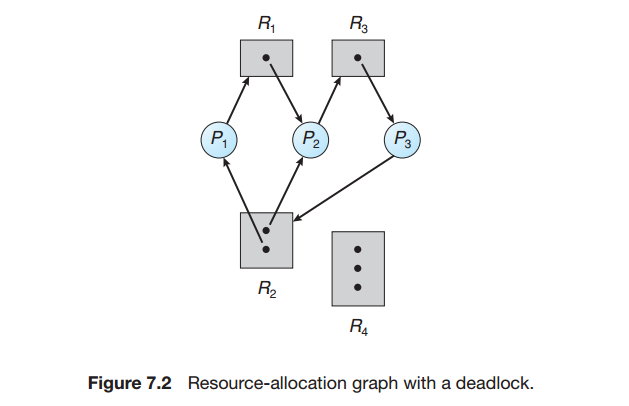
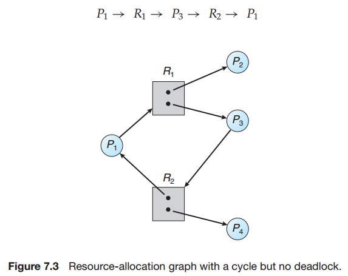
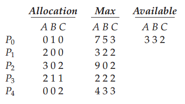
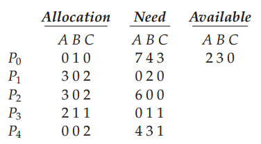

## Chapter 07: Deadlocks

### 7.1 System Model

### 7.2 Deadlock Characterization

- A deadlock situation can arise if the following four conditions hold simultaneously in a system:
	- Mutual exclusion.
	- Hold and wait.
	- No preemption.
	- Circular wait.

- Resource-allocation graph  
  
  

### 7.3 Methods for Handling Deadlocks

### 7.4 Deadlock Prevention

### 7.5 Deadlock Avoidance

- Banker's Algorithm  
  
  

### 7.6 Deadlock Detection

### 7.7 Recovery from Deadlock