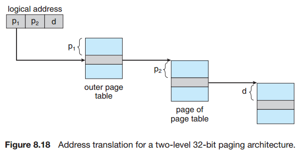

## Chapter 08: Main Memory

### 8.1 Background

- Registers that are built into the CPU are generally accessible within one cycle of the CPU clock. Most CPUs can decode instructions and perform simple operations on register contents at the rate of one or more operations per clock tick. The same cannot be said of main memory, which is accessed via a transaction on the memory bus. Completing a memory access may take many cycles of the CPU clock. In such cases, the processor normally needs to stall, since it does not have the data required to complete the instruction that it is executing. This situation is intolerable because of the frequency of memory accesses. The remedy is to add fast memory between the CPUand main memory, typically on the CPU chip for fast access. 

- base and limit register  
  
  

- Addresses may be represented in different ways during these steps. Addresses in the source program are generally symbolic (such as the variable count). A compiler typically binds these symbolic addresses to relocatable addresses (such as “14 bytes from the beginning of this module”). The linkage editor or loader in turn binds the relocatable addresses to absolute addresses (such as 74014). Each binding is a mapping from one address space to another.

- Classically, the binding of instructions and data to memory addresses can be done at any step along the way:
	- Compile time. If you know at compile time where the process will reside in memory, then absolute code can be generated.
	- Load time. If it is not known at compile time where the process will reside in memory, then the compiler must generate relocatable code. In this case, final binding is delayed until load time. If the starting address changes, we need only reload the user code to incorporate this changed value.
	- Execution time. If the process can be moved during its execution from one memory segment to another, then binding must be delayed until run time.

- Multistep processing of a user program  
  

- Dynamic relocation using a relocation register  
  

- To obtain better memory-space utilization, we can use dynamic loading. With dynamic loading, a routine is not loaded until it is called. Some operating systems support only static linking, in which system libraries are treated like any other object module and are combined by the loader into the binary program image.

- Dynamic linking, in contrast, is similar to dynamic loading. Here, though, linking, rather than loading, is postponed until execution time.

### 8.2 Swapping

- swapping  
  

### 8.3 Contiguous Memory Allocation

- relocation and limit registers.PNG  
  

- The first-fit, best-fit, and worst-fit strategies are the ones most commonly used to select a free hole from the set of available holes.
	- First fit. Allocate the first hole that is big enough.
	- Best fit. Allocate the smallest hole that is big enough.
	- Worst fit. Allocate the largest hole. 

- Both the first-fit and best-fit strategies for memory allocation suffer from external fragmentation. As processes are loaded and removed from memory, the free memory space is broken into little pieces. External fragmentation exists when there is enough total memory space to satisfy a request but the available spaces are not contiguous: storage is fragmented into a large number of small holes.

- The general approach to avoiding this problem is to break the physical memory into fixed-sized blocks and allocate memory in units based on block size. With this approach, the memory allocated to a process may be slightly larger than the requested memory. The difference between these two numbers is internal fragmentation—unused memory that
is internal to a partition.

- One solution to the problem of external fragmentation is compaction. The goal is to shuffle the memory contents so as to place all free memory together in one large block. Compaction is not always possible, however. If relocation is static and is done at assembly or load time, compaction cannot be done. It is possible only if relocation is dynamic and is done at execution time.

- Another possible solution to the external-fragmentation problem is to permit the logical address space of the processes to be noncontiguous, thus allowing a process to be allocated physical memory wherever such memory is available. Two complementary techniques achieve this solution: segmentation and paging.

### 8.4 Segmentation

- Segmentation  
  
  

### 8.5 Paging

- Paging  
  
  
  

- The TLB is used with page tables in the following way. The TLB contains only a few of the page-table entries. When a logical address is generated by the CPU, its page number is presented to the TLB. If the page number is found, its frame number is immediately available and is used to access memory. As just mentioned, these steps are executed as part of the instruction pipeline within the CPU, adding no performance penalty compared with a system that does not implement paging.

- If the page number is not in the TLB (known as a TLB miss), a memory reference to the page table must be made. Depending on the CPU, this may be done automatically in hardware or via an interrupt to the operating system. When the frame number is obtained, we can use it to access memory. In addition, we add the page number and frame number to the TLB, so that they will be found quickly on the next reference. If the TLB is already full of entries, an existing entry must be selected for replacement. Replacement policies range from least recently used (LRU) through round-robin to random. Some CPUs allow the operating system to participate in LRU entry replacement, while others handle the matter themselves. Furthermore, some TLBs allow certain entries to be wired down, meaning that they cannot be removed from the TLB. Typically, TLB entries for key kernel code are wired down.

- Paging with TLB  
  

### 8.6 Structure of the Page Table

- Hierarchical paging  
  

- Hashed page table  
  

- Inverted page table  
  

- **TODO INVERTED PAGE TABLE**

### 8.7 Example: Intel 32 and 64-bit Architectures

### 8.8 Example: ARM Architecture