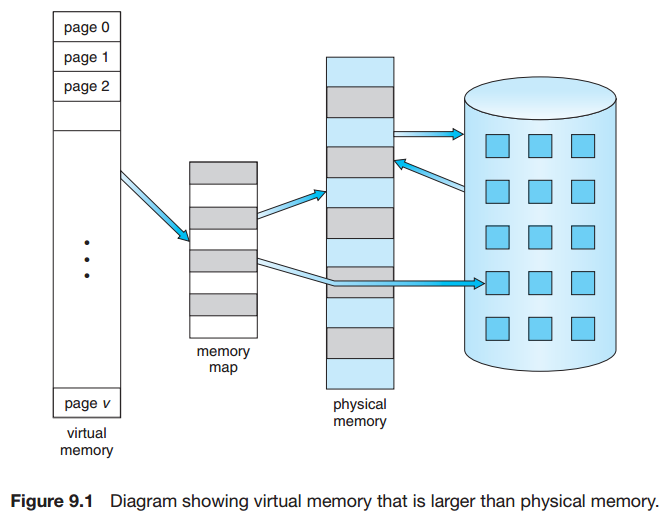
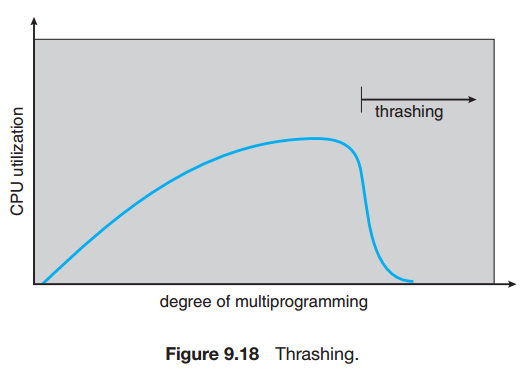
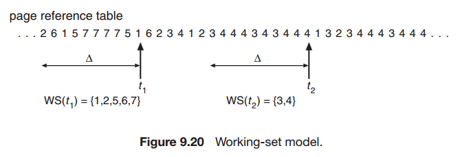
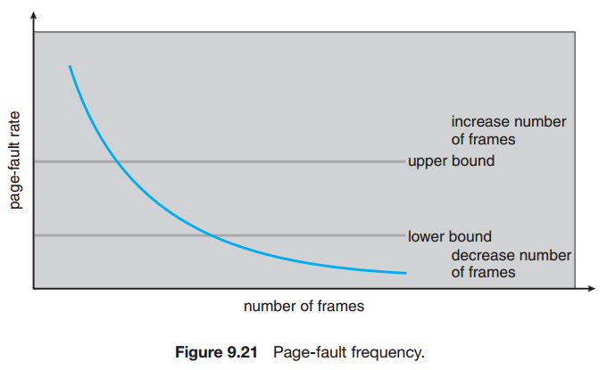
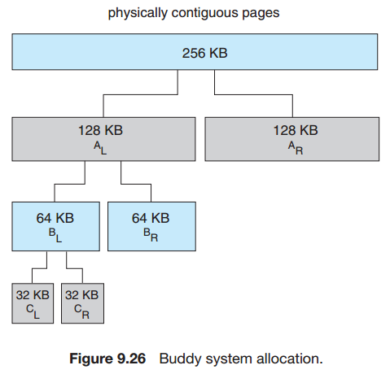
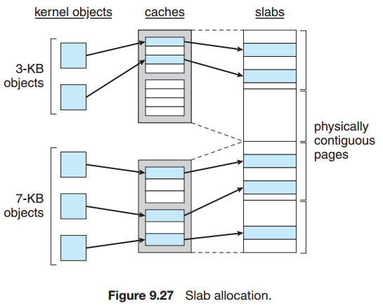

## Chapter 09: Virtual Memory

### 9.1 Background

- Virtual memory involves the separation of logical memory as perceived by users from physical memory. This separation allows an extremely large virtual memory to be provided for programmers when only a smaller physical memory is available. Virtual memory makes the task of programming much easier, because the programmer no longer needs to worry about the amount of physical memory available; she can concentrate instead on the problem to be programmed.

- Virtual Memory  
  

### 9.2 Demanding Paging

- Let *p* be the probability of a page fault (0 ≤ *p* ≤ 1). We would expect *p* to be close to zero—that is, we would expect to have only a few page faults. The effective access time is then
	- effective access time = (1 − *p*) × *ma* + *p* × page fault time

### 9.3 Copy-on-Write

- Traditionally, fork() worked by creating a copy of the parent’s address space for the child, duplicating the pages belonging to the parent. However, considering that many child processes invoke the exec() system call immediately after creation, the copying of the parent’s address space may be unnecessary. Instead, we can use a technique known as copy-on-write, which works by allowing the parent and child processes initially to share the same pages. These shared pages are marked as copy-on-write pages, meaning that if either process writes to a shared page, a copy of the shared page is created.

- copy on write  
  
  

### 9.4 Page Replacement

- The simplest page-replacement algorithm is a first-in, first-out (FIFO) algorithm. A FIFO replacement algorithm associates with each page the time when that page was brought into memory. When a page must be replaced, the oldest page is chosen.

- One result of the discovery of Belady’s anomaly was the search for an optimal page-replacement algorithm—the algorithm that has the lowest page-fault rate of all algorithms and will never suffer from Belady’s anomaly. Such an algorithm does exist and has been called OPT or MIN. It is simply this: Replace the page that will not be used for the longest period of time.

- If the optimal algorithm is not feasible, perhaps an approximation of the optimal algorithm is possible. The key distinction between the FIFO and OPT algorithms (other than looking backward versus forward in time) is that the FIFO algorithm uses the time when a page was brought into memory, whereas the OPT algorithm uses the time when a page is to be used. If we use the recent past as an approximation of the near future, then we can replace the page that has not been used for the longest period of time. This approach is the least recently used (LRU) algorithm.

- LRU-Approximation Page Replacement
	- Additional-Reference-Bits Algorithm: We can gain additional ordering information by recording the reference bits at regular intervals. We can keep an 8-bit byte for each page in a table in memory. At regular intervals (say, every 100 milliseconds), a timer interrupt transfers control to the operating system. The operating system shifts the reference bit for each page into the high-order bit of its 8-bit byte, shifting the other bits right by 1 bit and discarding the low-order bit.

	- Second-Chance Algorithm: The basic algorithm of second-chance replacement is a FIFO replacement algorithm. When a page has been selected, however, we inspect its reference bit. If the value is 0, we proceed to replace this page; but if the reference bit is set to 1, we give the page a second chance and move on to select the next FIFO page. When a page gets a second chance, its reference bit is cleared, and its arrival time is reset to the current time.

	- Enhanced Second-Chance Algorithm: We can enhance the second-chance algorithm by considering the reference bit and the modify bit as an ordered pair.

- Counting-Based Page Replacement
	- The least frequently used (LFU) page-replacement algorithm requires that the page with the smallest count be replaced. The reason for this selection is that an actively used page should have a large reference count.
	- The most frequently used (MFU) page-replacement algorithm is based on the argument that the page with the smallest count was probably just brought in and has yet to be used.

### 9.5 Allocation of Frames

- Global replacement allows a process to select a replacement frame from the set of all frames, even if that frame is currently allocated to some other process; that is, one process can take a frame from another. Local replacement requires that each process select from only its own set of allocated frames.

- One problem with a global replacement algorithm is that a process cannot control its own page-fault rate. The set of pages in memory for a process depends not only on the paging behavior of that process but also on the paging behavior of other processes. Therefore, the same process may perform quite differently because of totally external circumstances. Such is not the case with a local replacement algorithm. Under local replacement, the set of pages in memory for a process is affected by the paging behavior of only that process. Local replacement might hinder a process, however, by not making available to it other, less used pages of memory. Thus, global replacement generally results in greater system throughput and is therefore the more commonly used method.

### 9.6 Thrashing

- The operating system monitors CPU utilization. If CPU utilization is too low, we increase the degree of multiprogramming by introducing a new process to the system. A global page-replacement algorithm is used; it replaces pages without regard to the process to which they belong. Now suppose that a process enters a new phase in its execution and needs more frames. It starts faulting and taking frames away from other processes. These processes need those pages, however, and so they also fault, taking frames from other processes. These faulting processes must use the paging device to swap pages in and out. As they queue up for the paging device, the ready queue empties. As processes wait for the paging device, CPU utilization decreases.

- The CPU scheduler sees the decreasing CPU utilization and increases the degree of multiprogramming as a result. The new process tries to get started by taking frames from running processes, causing more page faults and a longer queue for the paging device. As a result, CPU utilization drops even further, and the CPU scheduler tries to increase the degree of multiprogramming even more. Thrashing has occurred, and system throughput plunges. The pagefault rate increases tremendously. As a result, the effective memory-access time increases. No work is getting done, because the processes are spending all their time paging.

- Thrashing  
  

- The working-set model is based on the assumption of locality. This model uses a parameter, Δ, to define the working-set window. The idea is to examine the most recent Δ page references. The set of pages in the most recent Δ page references is the working set. If a page is in active use, it will be in the working set. If it is no longer being used, it will drop from the working set Δ time units after its last reference. Thus, the working set is an approximation of the program’s locality.

- working-set model  
  

- The working-set model is successful, and knowledge of the working set can be useful for prepaging (Section 9.9.1), but it seems a clumsy way to control thrashing. A strategy that uses the page-fault frequency (PFF) takes a more direct approach.

- page fault frequency  
  

### 9.7 Memory-Mapped Files

- Memory mapping a file is accomplished by mapping a disk block to a page (or pages) in memory. Initial access to the file proceeds through ordinary demand paging, resulting in a page fault. However, a page-sized portion of the file is read from the file system into a physical page (some systems may opt to read in more than a page-sized chunk of memory at a time). Subsequent reads and writes to the file are handled as routine memory accesses. Manipulating files through memory rather than incurring the overhead of using the read() and write() system calls simplifies and speeds up file access and usage.

### 9.8 Allocating Kernel Memory

- The buddy system allocates memory from a fixed-size segment consisting of physically contiguous pages. Memory is allocated from this segment using a power-of-2 allocator, which satisfies requests in units sized as a power of 2 (4 KB, 8 KB, 16 KB, and so forth). A request in units not appropriately sized is rounded up to the next highest power of 2.

- buddy system allocation

- A second strategy for allocating kernel memory is known as slab allocation. A slab is made up of one or more physically contiguous pages. A cache consists of one or more slabs. There is a single cache for each unique kernel data structure - for example, a separate cache for the data structure representing process descriptors, a separate cache for file objects, a separate cache for semaphores, and so forth. Each cache is populated with objects that are instantiations of the kernel data structure the cache represents. For example, the cache representing semaphores stores instances of semaphore objects, the cache representing process descriptors stores instances of process descriptor objects, and so forth.

- slab allocation

### 9.9 Other Considerations

### 9.10 Operating-System Examples