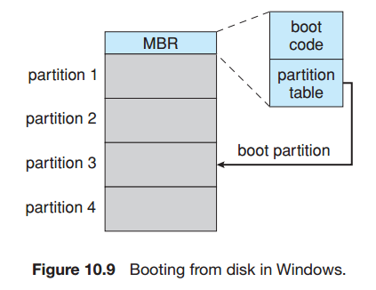
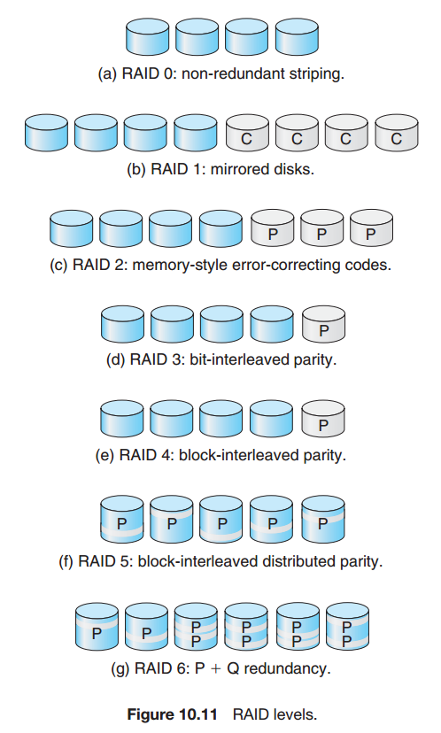

## Chapter 10: Mass-Storage Structure

### 10.1 Overview of Mass-Storage Structure

- Moving-head disk mechanism  
  

- A read–write head “flies” just above each surface of every platter. The heads are attached to a disk arm that moves all the heads as a unit. The surface of a platter is logically divided into circular tracks, which are subdivided into sectors. The set of tracks that are at one arm position makes up a cylinder. There may be thousands of concentric cylinders in a disk drive, and each track may contain hundreds of sectors.

- Disk speed has two parts. The transfer rate is the rate at which data flow between the drive and the computer. The positioning time, or random-access time, consists of two parts: the time necessary to move the disk arm to the desired cylinder, called the seek time, and the time necessary for the desired sector to rotate to the disk head, called the rotational latency.

### 10.2 Disk Structure

### 10.3 Disk Attachment

- **TODO NAS & SAN**

### 10.4 Disk Scheduling

- The simplest form of disk scheduling is, of course, the first-come, first-served (FCFS) algorithm. This algorithm is intrinsically fair, but it generally does not provide the fastest service.

- It seems reasonable to service all the requests close to the current head position before moving the head far away to service other requests. This assumption is the basis for the shortest-seek-time-first (SSTF) algorithm. The SSTF algorithm selects the request with the least seek time from the current head position. In other words, SSTF chooses the pending request closest to the current head position.

- In the SCAN algorithm, the disk arm starts at one end of the disk and moves toward the other end, servicing requests as it reaches each cylinder, until it gets to the other end of the disk. At the other end, the direction of head movement is reversed, and servicing continues. The head continuously scans back and forth across the disk. The SCAN algorithm is sometimes called the elevator algorithm, since the disk arm behaves just like an elevator in a building, first servicing all the requests going up and then reversing to service requests the other way.

- Circular SCAN (C-SCAN) scheduling is a variant of SCAN designed to provide a more uniform wait time. Like SCAN, C-SCAN moves the head from one end of the disk to the other, servicing requests along the way. When the head reaches the other end, however, it immediately returns to the beginning of the disk without servicing any requests on the return trip. The C-SCAN scheduling algorithm essentially treats the cylinders as a circular list that wraps around from the final cylinder to the first one.

- As we described them, both SCAN and C-SCAN move the disk arm across the full width of the disk. In practice, neither algorithm is often implemented this way. More commonly, the arm goes only as far as the final request in each direction. Then, it reverses direction immediately, without going all the way to the end of the disk. Versions of SCAN and C-SCAN that follow this pattern are called LOOK and C-LOOK scheduling, because they look for a request before continuing to move in a given direction.

### 10.5 Disk Management

- A new magnetic disk is a blank slate: it is just a platter of a magnetic recording material. Before a disk can store data, it must be divided into sectors that the disk controller can read and write. This process is called low-level formatting, or physical formatting. Low-level formatting fills the disk with a special data structure for each sector. The data structure for a sector typically consists of a header, a data area (usually 512 bytes in size), and a trailer. The header and trailer contain information used by the disk controller, such as a sector number and an error-correcting code (ECC).

- Before it can use a disk to hold files, the operating system still needs to record its own data structures on the disk. It does so in two steps. The first step is to partition the disk into one or more groups of cylinders. The operating system can treat each partition as though it were a separate disk. For instance, one partition can hold a copy of the operating system’s executable code, while another holds user files. The second step is logical formatting, or creation of a file system. In this step, the operating system stores the initial file-system data structures onto the disk. These data structures may include maps of free and allocated space and an initial empty directory.

- For a computer to start running—for instance, when it is powered up or rebooted—it must have an initial program to run. This initial bootstrap program tends to be simple. It initializes all aspects of the system, from CPU registers to device controllers and the contents of main memory, and then starts the operating system. To do its job, the bootstrap program finds the operating-system kernel on disk, loads that kernel into memory, and jumps to an initial address to begin the operating-system execution.

- For most computers, the bootstrap is stored in read-only memory (ROM). This location is convenient, because ROM needs no initialization and is at a fixed location that the processor can start executing when powered up or reset. And, since ROM is read only, it cannot be infected by a computer virus. The problem is that changing this bootstrap code requires changing the ROM hardware chips.

- For this reason, most systems store a tiny bootstrap loader program in the boot ROM whose only job is to bring in a full bootstrap program from disk. The full bootstrap program can be changed easily: a new version is simply written onto the disk. The full bootstrap program is stored in the “boot blocks” at a fixed location on the disk. A disk that has a boot partition is called a boot disk or system disk. The code in the boot ROM instructs the disk controller to read the boot blocks into memory (no device drivers are loaded at this point) and then starts executing that code. The full bootstrap program is more sophisticated than the bootstrap loader in the boot ROM. It is able to load the entire operating system
from a non-fixed location on disk and to start the operating system running. Even so, the full bootstrap code may be small.

- Booting from disk in windows  
  

### 10.6 Swap-Space Management

### 10.7 RAID Structure

- The solution to the problem of reliability is to introduce redundancy; we store extra information that is not normally needed but that can be used in the event of failure of a disk to rebuild the lost information. Thus, even if a disk fails, data are not lost.

- With multiple disks, we can improve the transfer rate as well (or instead) by striping data across the disks. In its simplest form, data striping consists of splitting the bits of each byte across multiple disks; such striping is called bit-level striping.

- RAID levels  
  

- RAID level 0. RAID level 0 refers to disk arrays with striping at the level of blocks but without any redundancy (such as mirroring or parity bits).

- RAID level 1. RAID level 1 refers to disk mirroring.

- RAID level 2. RAID level 2 is also known as memory-style error-correctingcode (ECC) organization. Error-correcting schemes store two or more extra bits and can reconstruct the data if a single bit is damaged.

- RAID level 3. RAID level 3, or bit-interleaved parity organization, improves on level 2 by taking into account the fact that, unlike memory systems, disk controllers can detect whether a sector has been read correctly, so a single parity bit can be used for error correction as well as for detection.

- RAID level 4. RAID level 4, or block-interleaved parity organization, uses block-level striping, as in RAID 0, and in addition keeps a parity block on a separate disk for corresponding blocks from N other disks.

- RAID level 5. RAID level 5, or block-interleaved distributed parity, differs from level 4 in that it spreads data and parity among all N+ 1 disks, rather than storing data in N disks and parity in one disk. By spreading the parity across all the disks in the set, RAID 5 avoids potential overuse of a single parity disk, which can occur with RAID 4. RAID 5 is the most common parity RAID system.

- RAID level 6. RAID level 6, also called the P + Q redundancy scheme, is much like RAID level 5 but stores extra redundant information to guard against multiple disk failures. Instead of parity, error-correcting codes such as the Reed–Solomon codes are used.

- RAID levels 0 + 1 and 1 + 0.
	- RAID level 0 + 1 refers to a combination of RAID levels 0 and 1. RAID 0 provides the performance, while RAID 1 provides the reliability. Generally, this level provides better performance than RAID 5. It is common in environments where both performance and reliability are important. Unfortunately, like RAID 1, it doubles the number of disks needed for storage, so it is also relatively expensive. In RAID 0 + 1, a set of disks are striped, and then the stripe is mirrored to another, equivalent stripe.
	- Another RAID option that is becoming available commercially is RAID level 1 + 0, in which disks are mirrored in pairs and then the resulting mirrored pairs are striped. This scheme has some theoretical advantages over RAID 0 + 1. For example, if a single disk fails in RAID 0 + 1, an entire stripe is inaccessible, leaving only the other stripe. With a failure in RAID 1 + 0, a single disk is unavailable, but the disk that mirrors it is still available, as are all the rest of the disks (Figure 10.12).

- RAID 0 + 1 and 1 + 0  
  

- One other aspect of most RAID implementations is a hot spare disk or disks. A hot spare is not used for data but is configured to be used as a replacement in case of disk failure. For instance, a hot spare can be used to rebuild a mirrored pair should one of the disks in the pair fail. In this way, the RAID level can be reestablished automatically, without waiting for the failed disk to be replaced.

### 10.8 Stable-Storage Implementation