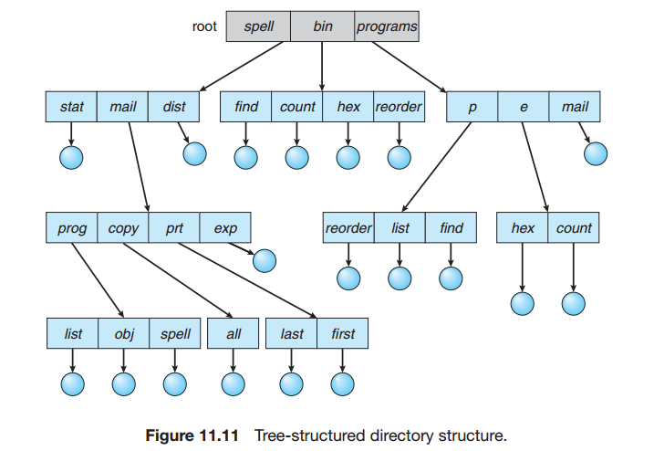

## Chapter 11: File-System Interface

### 11.1 File Concept

- A file is a named collection of related information that is recorded on secondary storage. From a user’s perspective, a file is the smallest allotment of logical secondary storage; that is, data cannot be written to secondary storage unless they are within a file. Commonly, files represent programs (both source and object forms) and data.

- A file’s attributes vary from one operating system to another but typically consist of these:
	- Name.
	- Identifier.
	- Location.
	- Size.
	- Protection.
	- Time, date, and user identification.

- The operating system can provide system calls to create, write, read, reposition, delete, and truncate files. Let’s examine what the operating system must do to perform each of these six basic file operations. It should then be easy to see how other similar operations, such as renaming a file, can be implemented.
	- Creating a file.
	- Writing a file.
	- Reading a file.
	- Repositioning within a file.
	- Deleting a file.
	- Truncating a file.

- Typically, the operating system uses two levels of internal tables: a per-process table and a system-wide table. The perprocess table tracks all files that a process has open. Stored in this table is information regarding the process’s use of the file. For instance, the current file pointer for each file is found here. Access rights to the file and accounting information can also be included.

- Each entry in the per-process table in turn points to a system-wide open-file table. The system-wide table contains process-independent information, such as the location of the file on disk, access dates, and file size. Once a file has been opened by one process, the system-wide table includes an entry for the file. When another process executes an open() call, a new entry is simply added to the process’s open-file table pointing to the appropriate entry in the system-wide table. Typically, the open-file table also has an open count associated with each file to indicate how many processes have the file open. Each close() decreases this open count, and when the open count reaches zero, the file is no longer in use, and the file’s entry is removed from the open-file table.

- In summary, several pieces of information are associated with an open file.
	- File pointer.
	- File-open count.
	- Disk location of the file.
	- Access rights.

### 11.2 Access Methods

- The simplest access method is sequential access. Information in the file is processed in order, one record after the other.

- Another method is direct access (or relative access). Here, a file is made up of fixed-length logical records that allow programs to read and write records rapidly in no particular order.

- Other access methods can be built on top of a direct-access method. These methods generally involve the construction of an index for the file. The index, like an index in the back of a book, contains pointers to the various blocks. To find a record in the file, we first search the index and then use the pointer to access the file directly and to find the desired record.

### 11.3 Directory and Disk Structure

- A storage device can be used in its entirety for a file system. It can also be subdivided for finer-grained control. For example, a disk can be partitioned into quarters, and each quarter can hold a separate file system. Storage devices can also be collected together into RAID sets that provide protection from the failure of a single disk. Sometimes, disks are subdivided and also collected into RAID sets.

- Any entity containing a file system is generally known as a volume. The volume may be a subset of a device, a whole device, or multiple devices linked together into a RAID set. Each volume can be thought of as a virtual disk. Volumes can also store multiple operating systems, allowing a system to boot and run more than one operating system.

- Each volume that contains a file system must also contain information about the files in the system. This information is kept in entries in a device directory or volume table of contents. The device directory (more commonly known simply as the directory) records information—such as name, location, size, and type—for all files on that volume.

- file-system organization  
  

- When considering a particular directory structure, we need to keep in mind the operations that are to be performed on a directory:
	- Search for a file.
	- Create a file.
	- Delete a file.
	- List a directory.
	- Rename a file.
	- Traverse the file system.

- A directory (or subdirectory) contains a set of files or subdirectories. A directory is simply another file, but it is treated in a special way. All directories have the same internal format. One bit in each directory entry defines the entry as a file (0) or as a subdirectory (1). Special system calls are used to create and delete directories.

- The simplest directory structure is the single-level directory. All files are contained in the same directory, which is easy to support and understand.
  

- In the two-level directory structure, each user has his own user file directory (UFD). The UFDs have similar structures, but each lists only the files of a single user. When a user job starts or a user logs in, the system’s master file directory (MFD) is searched. The MFD is indexed by user name or account number, and each entry points to the UFD for that user.
  

- Once we have seen how to view a two-level directory as a two-level tree, the natural generalization is to extend the directory structure to a tree of arbitrary height (Figure 11.11). This generalization allows users to create their own subdirectories and to organize their files accordingly. A tree is the most common directory structure. The tree has a root directory, and every file in the system has a unique path name.
  

- A tree structure prohibits the sharing of files or directories. An acyclic graph — that is, a graph with no cycles—allows directories to share subdirectories and files. The same file or subdirectory may be in two different directories. The acyclic graph is a natural generalization of the tree-structured directory scheme.
  

- A serious problem with using an acyclic-graph structure is ensuring that there are no cycles. If we start with a two-level directory and allow users to create subdirectories, a tree-structured directory results. It should be fairly easy to see that simply adding new files and subdirectories to an existing tree-structured directory preserves the tree-structured nature. However, when we add links, the tree structure is destroyed, resulting in a simple graph structure.
  

### 11.4 File-System Mounting

- Just as a file must be opened before it is used, a file system must be mounted before it can be available to processes on the system. More specifically, the directory structure may be built out of multiple volumes, which must be mounted to make them available within the file-system name space.

- The mount procedure is straightforward. The operating system is given the name of the device and the mount point—the location within the file structure where the file system is to be attached.

- mount  
   
   

### 11.5 File Sharing

- **TODO LDAP**

### 11.6 Protection

- Protection mechanisms provide controlled access by limiting the types of file access that can be made. Access is permitted or denied depending on several factors, one of which is the type of access requested. Several different types of operations may be controlled:
	- Read.
	- Write.
	- Execute.
	- Append.
	- Delete.
	- List.

- The most common approach to the protection problem is to make access dependent on the identity of the user. Different users may need different types of access to a file or directory. The most general scheme to implement identitydependent access is to associate with each file and directory an access-control list (ACL) specifying user names and the types of access allowed for each user.

- To condense the length of the access-control list, many systems recognize three classifications of users in connection with each file:
	- Owner.
	- Group.
	- Universe.

- With the more limited protection classification, only three fields are needed to define protection. Often, each field is a collection of bits, and each bit either allows or prevents the access associated with it. For example, the UNIX system defines three fields of 3 bits each — rwx, where r controls read access, w controls write access, and x controls execution. A separate field is kept for the file owner, for the file’s group, and for all other users. In this scheme, 9 bits per file are needed to record protection information.