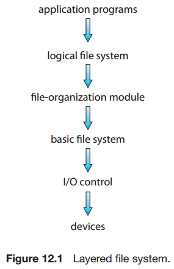
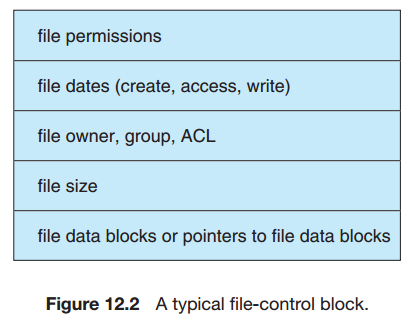
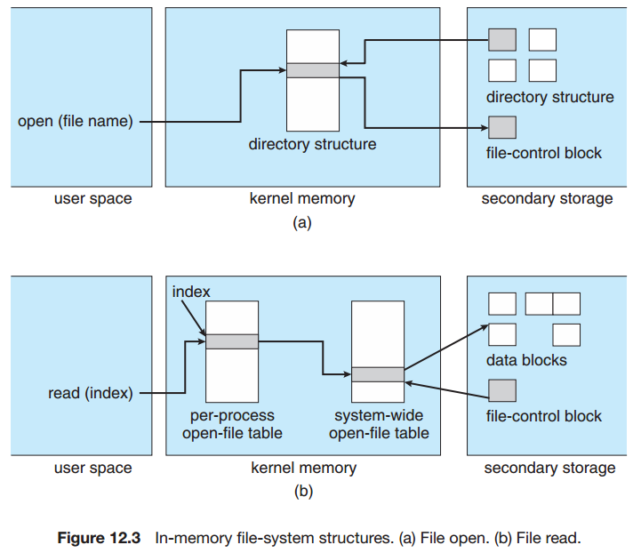
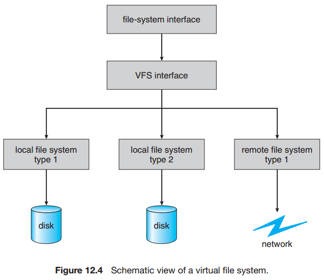
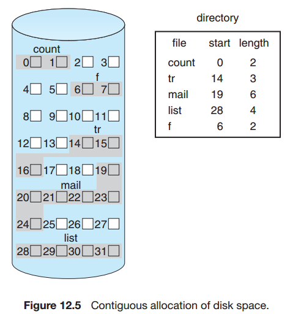
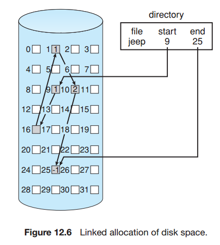
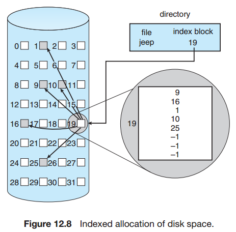
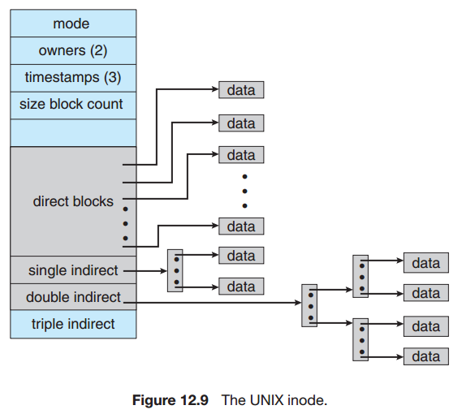
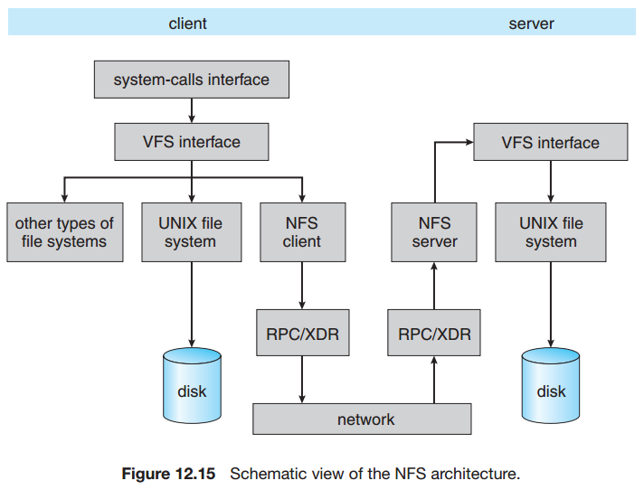

## Chapter 12: File-System Implementation

### 12.1 File-System Structure

- layered file system  
  

- Several on-disk and in-memory structures are used to implement a file system. These structures vary depending on the operating system and the file system, but some general principles apply.

- On disk, the file system may contain information about how to boot an operating system stored there, the total number of blocks, the number and location of free blocks, the directory structure, and individual files.
	- A boot control block (per volume) can contain information needed by the system to boot an operating system from that volume.
	- A volume control block (per volume) contains volume (or partition) details, such as the number of blocks in the partition, the size of the blocks, a free-block count and free-block pointers, and a free-FCB count and FCB pointers.
	- A directory structure (per file system) is used to organize the files.
	- A per-file FCB contains many details about the file. It has a unique identifier number to allow association with a directory entry.

- The in-memory information is used for both file-system management and performance improvement via caching. The data are loaded at mount time, updated during file-system operations, and discarded at dismount. Several types of structures may be included.
	- An in-memory mount table contains information about each mounted volume.
	- An in-memory directory-structure cache holds the directory information of recently accessed directories. (For directories at which volumes are mounted, it can contain a pointer to the volume table.)
	- The system-wide open-file table contains a copy of the FCB of each open file, as well as other information.
	- The per-process open-file table contains a pointer to the appropriate entry in the system-wide open-file table, as well as other information.
	- Buffers hold file-system blocks when they are being read from disk or written to disk.

- file-control block  
  

- file-system structures  
  

- VFS  
  

- The four main object types defined by the Linux VFS are:
	- The inode object, which represents an individual file
	- The file object, which represents an open file
	- The superblock object, which represents an entire file system
	- The dentry object, which represents an individual directory entry

- Three major methods of allocating disk space are in wide use: contiguous, linked, and indexed.

- Contiguous allocation  
  

- Linked allocation  
  

- Indexed allocation  
  

- UNIX inode  
  

### 12.5 Free-Space Management

- To keep track of free disk space, the system maintains a free-space list. The free-space list records all free disk blocks — those not allocated to some file or directory.
	- Bit Vector
	- Linked List
	- Grouping
	- Counting
	- Space Maps

### 12.6 Efficiency and Performance

### 12.7 Recovery

### 12.8 NFS

- NFS architecture  
  

### 12.9 Example: The WAFL File System