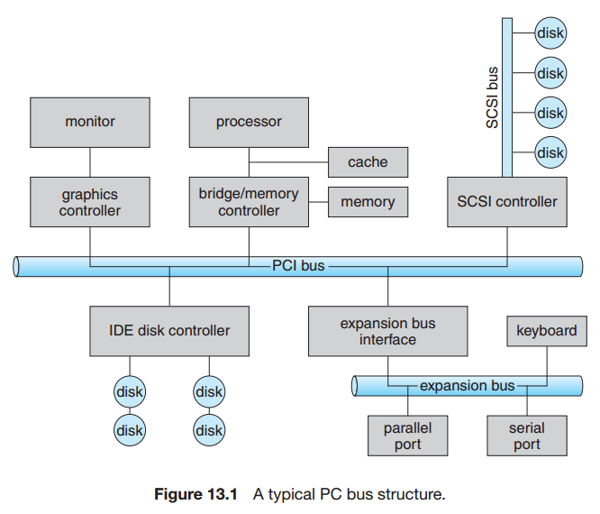
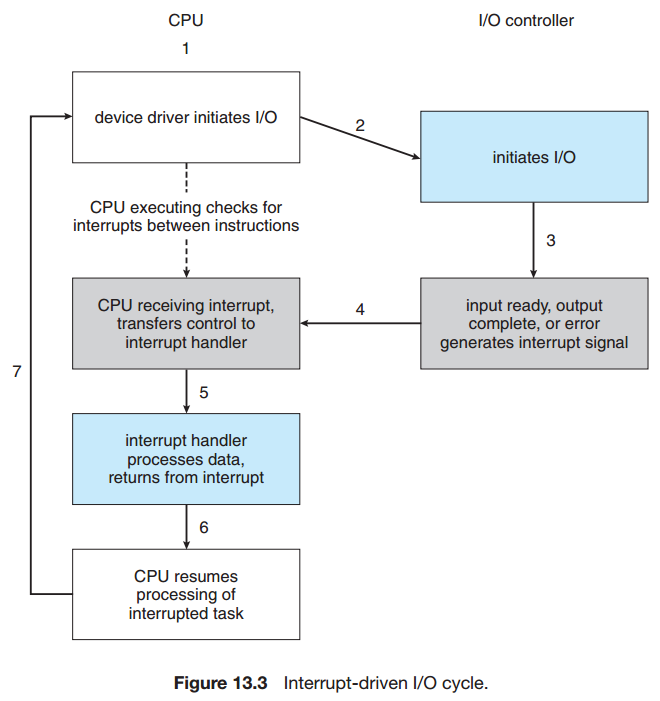
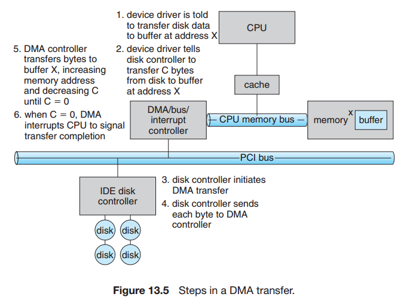
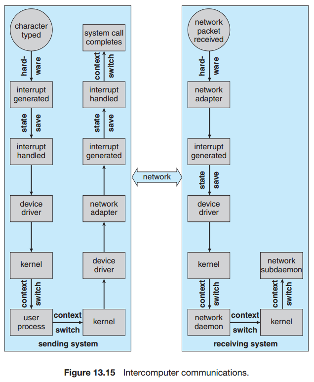

## Chapter 13: I/O Systems

### 13.1 Overview

### 13.2 I/O Hardware

- A device communicates with a computer system by sending signals over a cable or even through the air. The device communicates with the machine via a connection point, or port—for example, a serial port. If devices share a common set of wires, the connection is called a bus. A bus is a set of wires and a rigidly defined protocol that specifies a set of messages that can be sent on the wires. In terms of the electronics, the messages are conveyed by patterns of electrical voltages applied to the wires with defined timings. A controller is a collection of electronics that can operate a port, a bus, or a device.

- PC bus strucure  
  

- An I/O port typically consists of four registers, called the status, control, data-in, and data-out registers.
	- The data-in register is read by the host to get input.
	- The data-out register is written by the host to send output.
	- The status register contains bits that can be read by the host.
	- The control register can be written by the host to start a command or to change the mode of a device.

- Polling

- Interrupts

- Interrupt-driven I/O cycle  
  

- Usually, a program uses library calls to issue system calls. The library routines check the arguments given by the application, build a data structure to convey the arguments to the kernel, and then execute a special instruction called a software interrupt, or trap. This instruction has an operand that identifies the desired kernel service. When a process executes the trap instruction, the interrupt hardware saves the state of the user code, switches to kernel mode, and dispatches to the kernel routine that implements the requested service.

- For a device that does large transfers, such as a disk drive, it seems wasteful to use an expensive general-purpose processor to watch status bits and to feed data into a controller register one byte at a time—a process termed programmed I/O (PIO). Many computers avoid burdening the main CPU with PIO by offloading some of this work to a special-purpose processor called a direct-memory-access (DMA) controller. To initiate a DMA transfer, the host writes a DMA command block into memory. This block contains a pointer to the source of a transfer, a pointer to the destination of the transfer, and a count of the number of bytes to be transferred. The CPU writes the address of this command block to the DMA controller, then goes on with other work. The DMA controller proceeds to operate the memory bus directly, placing addresses on the bus to perform transfers without the help of the main CPU. A simple DMA controller is a standard component in all modern computers, from smartphones to mainframes.

- DMA transfer  
  

### 13.3 Application I/O Interface

### 13.4 Kernel I/O Subsystem

- A spool is a buffer that holds output for a device, such as a printer, that cannot accept interleaved data streams. Although a printer can serve only one job at a time, several applications may wish to print their output concurrently, without having their output mixed together. The operating system solves this problem by intercepting all output to the printer. Each application’s output is spooled to a separate disk file. When an application finishes printing, the spooling system queues the corresponding spool file for output to the printer. The spooling system copies the queued spool files to the printer one at a time.

### 13.5 Transforming I/O Requests to Hardware Operations

### 13.6 STREAMS

### 13.7 Performance

- intercomputer communications  
  