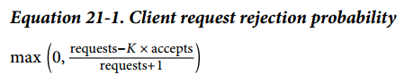

## Chapter 21: Handling Overload

### The Pitfalls of “Queries per Second”

- We learned this lesson the hard way: modeling capacity as “queries per second” or using static features of the requests that are believed to be a proxy for the resources they consume often makes for a poor metric. A moving target makes a poor metric for designing and implementing load balancing.

- A better solution is to measure capacity directly in available resources. We often speak about the cost of a request to refer to a normalized measure of how much CPU time it has consumed (over different CPU architectures, with consideration of performance differences).

- In a majority of cases (although certainly not in all), we’ve found that simply using CPU consumption as the signal for provisioning works well, for the following reasons:
	- In platforms with garbage collection, memory pressure naturally translates into increased CPU consumption.
	- In other platforms, it’s possible to provision the remaining resources in such a way that they’re very unlikely to run out before CPU runs out.

### Per-Customer Limits

- When global overload does occur, it’s vital that the service only delivers error responses to misbehaving customers, while other customers remain unaffected. To achieve this outcome, service owners provision their capacity based on the negotiated usage with their customers and define per-customer quotas according to these agreements.

### Client-Side Throttling

- When a customer is out of quota, a backend task should reject requests quickly with the expectation that returning a “customer is out of quota” error consumes significantly fewer resources than actually processing the request and serving back a correct response. However, this logic doesn’t hold true for all services. If the amount of rejected requests is significant, these numbers add up quickly. In such cases, the backend can become overloaded even though the vast majority of its CPU is spent just rejecting requests!

- We implemented client-side throttling through a technique we call adaptive throttling. Specifically, each client task keeps the following information for the last two minutes of its history:
	- **requests** The number of requests attempted by the application layer (at the client, on top of the adaptive throttling system)
	- **accepts** The number of requests accepted by the backend 
	Under normal conditions, the two values are equal. As the backend starts rejecting traffic, the number of accepts becomes smaller than the number of requests. Clients can continue to issue requests to the backend until requests is K times as large as accepts. Once that cutoff is reached, the client begins to self-regulate and new requests are rejected locally with the probability calculated in Equation 21-1.

	  

	As the rate at which the application attempts requests to the client grows (relative to the rate at which the backend accepts them), we want to increase the probability of dropping new requests.

- For services where the cost of processing a request is very close to the cost of rejecting that request, allowing roughly half of the backend resources to be consumed by rejected requests can be unacceptable. In this case, the solution is simple: modify the accepts multiplier K in the client request rejection probability. In this way:
	- Reducing the multiplier will make adaptive throttling behave more aggressively
	- Increasing the multiplier will make adaptive throttling behave less aggressively

### Criticality

- Criticality is another notion that we’ve found very useful in the context of global quotas and throttling. A request made to a backend is associated with one of four possible criticality values, depending on how critical we consider that request:
	- CRITICAL_PLUS
	- CRITICAL
	- SHEDDABLE_PLUS
	- SHEDDABLE

- In the past, many systems at Google had evolved their own ad hoc notions of criticality that were often incompatible across services. By standardizing and propagating criticality as a part of our RPC system, we are now able to consistently set the criticality at specific points. This means we can be confident that overloaded dependencies will abide by the desired high-level criticality as they reject traffic, regardless of how deep down the RPC stack they are. Our practice is thus to set the criticality as close as possible to the browsers or mobile clients—typically in the HTTP frontends that produce the HTML to be returned—and only override the criticality in specific cases where it makes sense at specific points in the stack.

### Utilization Signals

- The utilization signals we use are based on the state local to the task (since the goal of the signals is to protect the task) and we have implementations for various signals. The most generally useful signal is based on the “load” in the process, which is determined using a system we call executor load average.

- To find the executor load average, we count the number of active threads in the process. In this case, “active” refers to threads that are currently running or ready to run and waiting for a free processor. We smooth this value with exponential decay and begin rejecting requests as the number of active threads grows beyond the number of processors available to the task. That means that an incoming request that has a very large fan-out (i.e., one that schedules a burst of a very large number of short-lived operations) will cause the load to spike very briefly, but the smoothing will mostly swallow that spike. However, if the operations are not short-lived (i.e., the load increases and remains high for a significant amount of time), the task will start rejecting requests.

### Handling Overload Errors

- If a large subset of backend tasks in the datacenter are overloaded, requests should not be retried and errors should bubble up all the way to the caller (e.g., returning an error to the end user). It’s much more typical that only a small portion of tasks become overloaded, in which case the preferred response is to retry the request immediately. In general, our cross-datacenter load balancing system tries to direct traffic from clients to their nearest available backend datacenters.

### Deciding to Retry

- We have a few mechanisms in place to avoid retries when a significant portion of the tasks in a cluster are overloaded.
	- First, we implement a per-request retry budget of up to three attempts.
	- Secondly, we implement a per-client retry budget.
	- A third approach has clients include a counter of how many times the request has already been tried in the request metadata.

- Our larger services tend to be deep stacks of systems, which may in turn have dependencies on each other. In this architecture, requests should only be retried at the layer immediately above the layer that is rejecting them. When we decide that a given request can’t be served and shouldn’t be retried, we use an “overloaded; don’t retry” error and thus avoid a combinatorial retry explosion.

### Load from Connections

- We’ve seen bursts of this type happen in the case of very large batch jobs that create a very large number of worker client tasks all at once. The need to negotiate and maintain an excessive number of new connections simultaneously can easily overload a group of backends. In our experience, there are a couple strategies that can help mitigate this load:
	- Expose the load to the cross-datacenter load balancing algorithm (e.g., base load balancing on the utilization of the cluster, rather than just on the number of requests). In this case, load from requests is effectively rebalanced away to other datacenters that have spare capacity.
	- Mandate that batch client jobs use a separate set of batch proxy backend tasks that do nothing but forward requests to the underlying backends and hand their responses back to the clients in a controlled way. Therefore, instead of “batch client → backend,” you have “batch client → batch proxy → backend.” In this case, when the very large job starts, only the batch proxy job suffers, shielding the actual backends (and higher-priority clients). Effectively, the batch proxy acts like a fuse. Another advantage of using the proxy is that it typically reduces the number of connections against the backend, which can improve the load balancing against the backend (e.g., the proxy tasks can use bigger subsets and probably have a better view of the state of the backend tasks).