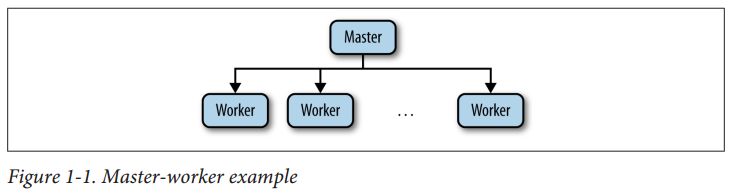

## Chapter 01: Introduction

- ZooKeeper was designed to be a robust service that enables application developers to focus mainly on their application logic rather than coordination. It exposes a simple API, inspired by the filesystem API, that allows developers to implement common coordination tasks, such as electing a master server, managing group membership, and managing metadata.

### The ZooKeeper Mission

- A coordination task is a task involving multiple processes. Such a task can be for the purposes of cooperation or to regulate contention. Cooperation means that processes need to do something together, and processes take action to enable other processes to make progress. Contention is different: it refers to situations in which two processes cannot make progress concurrently, so one must wait for the other. 

- Coordination does not always take the form of synchronization primitives like leader election or locks. Configuration metadata is often used as a way for a process to convey what others should be doing.

- When programming with ZooKeeper, developers design their applications as a set of clients that connect to ZooKeeper servers and invoke operations on them through the ZooKeeper client API. Among the strengths of the ZooKeeper API, it provides:
	- Strong consistency, ordering, and durability guarantees
	- The ability to implement typical synchronization primitives
	- A simpler way to deal with many aspects of concurrency that often lead to incorrect behavior in real distributed systems

- Processes in a distributed system have two broad options for communication: they can exchange messages directly through a network, or read and write to some shared storage. ZooKeeper uses the shared storage model to let applications implement coordination and synchronization primitives. But shared storage itself requires network communication between the processes and the storage. It is important to stress the role of network communication because it is an important source of complications in the design of a distributed system.

### Example: Master-Worker Application

- Master-worker example  
  

	In general, in such an architecture a master process is responsible for keeping track of the workers and tasks available, and for assigning tasks to workers. For ZooKeeper, this architecture style is representative because it illustrates a number of popular tasks, like electing a master, keeping track of available workers, and maintaining application metadata.

- To implement a master-worker system, we must solve three key problems:
	- **Master crashes** If the master is faulty and becomes unavailable, the system cannot allocate new tasks or reallocate tasks from workers that have also failed.
	- **Worker crashes** If a worker crashes, the tasks assigned to it will not be completed.
	- **Communication failures** If the master and a worker cannot exchange messages, the worker might not learn of new tasks assigned to it.

- Using locks for tasks (as with the case of master election) is not sufficient to avoid having tasks executed multiple times because we can have, for example, the following succession of events:
	- (1) Master M1 assigns Task T1 to Worker W1.
	- (2) W1 acquires the lock for T1, executes it, and releases the lock.
	- (3) Master M1 suspects that W1 has crashed and reassigns Task T1 to worker W2.
	- (4) W2 acquires the lock for T1, executes it, and releases the lock.

	Here, the lock over T1 did not prevent the task from being executed twice because the two workers did not interleave their steps when executing the task. To deal with cases in which exactly-once or at-most-once semantics are required, an application relies on mechanisms that are specific to its nature. For example, if application data has timestamps and a task is supposed to modify application data, then a successful execution of the task could be conditional on the timestamp values of the data it touches. The application also needs the ability to roll back partial changes in the case that the application state is not modified atomically; otherwise, it might end up with an inconsistent state.

- From the preceding descriptions, we can extract the following requirements for our master-worker architecture:
	- **Master election** It is critical for progress to have a master available to assign tasks to workers.
	- **Crash detection** The master must be able to detect when workers crash or disconnect.
	- **Group membership management** The master must be able to figure out which workers are available to execute tasks.
	- **Metadata management** The master and the workers must be able to store assignments and execution statuses in a reliable manner.

### Why Is Distributed Coordination Hard?

- Well, let’s take the simplest case. Let’s assume that we have a distributed configuration that has been changing. This configuration is as simple as it can be: one bit. The processes in our application can start up once all running processes have agreed on the value of the configuration bit.

	It turns out that a famous result in distributed computing, known as FLP after the authors Fischer, Lynch, and Patterson, proved that in a distributed system with asynchronous communication and process crashes, processes may not always agree on the one bit of configuration. A similar result known as CAP, which stands for Consistency, Availability, and Partition-tolerance, says that when designing a distributed system we may want all three of those properties, but that no system can handle all three.2 ZooKeeper has been designed with mostly consistency and availability in mind, although it also provides read-only capability in the presence of network partitions.

### ZooKeeper Is a Success, with Caveats

- Paxos and virtual synchrony have been particularly influential in the design of ZooKeeper. It deals with the changes and situations as they arise as seamlessly as possible, and gives developers a framework to deal with situations that arise that just cannot be handled automatically.