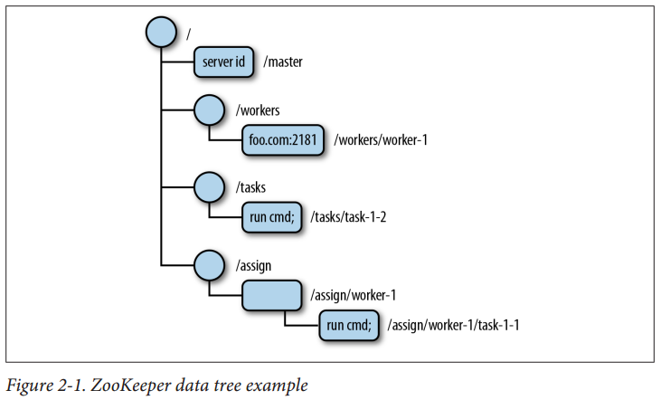
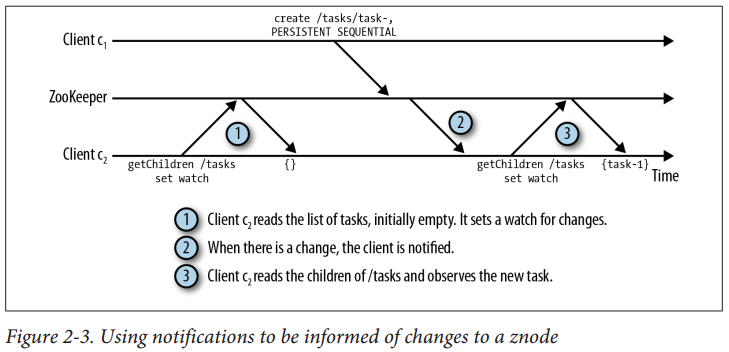
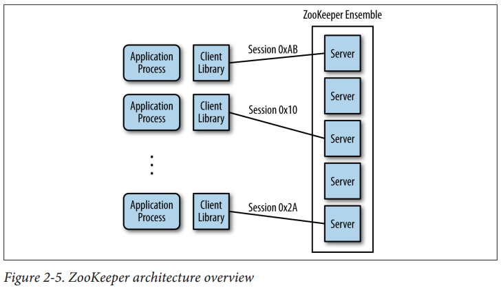
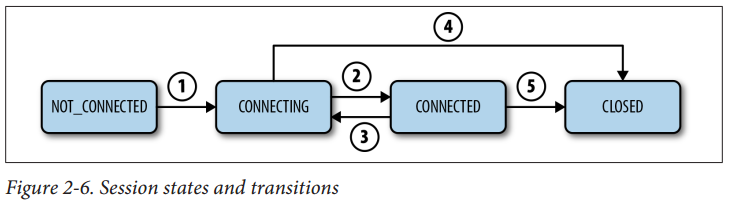
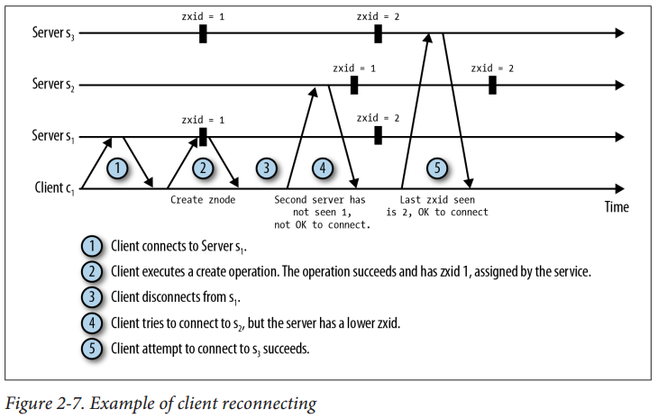

## Chapter 02: Getting to Grips with ZooKeeper

### ZooKeeper Basics

- We consequently have taken a different path with ZooKeeper. ZooKeeper does not expose primitives directly. Instead, it exposes a file system-like API comprised of a small set of calls that enables applications to implement their own primitives. We typically use recipes to denote these implementations of primitives. Recipes include ZooKeeper operations that manipulate small data nodes, called znodes, that are organized hierarchically as a tree, just like in a file system.

- ZooKeeper data tree example  
  

- The ZooKeeper API exposes the following operations:
  ```bash
  create /path data
  ```
	Creates a znode named with /path and containing data
  ```bash
  delete /path
  ```
	Deletes the znode /path
  ```bash
  exists /path
  ```
	Checks whether /path exists
  ```bash
  setData /path data
  ```
	Sets the data of znode /path to data
  ```bash
  getData /path
  ```
	Returns the data in /path
  ```bash
  getChildren /path
  ```
	Returns the list of children under /path

- A znode can be either persistent or ephemeral. A persistent znode /path can be deleted only through a call to delete. An ephemeral znode, in contrast, is deleted if the client that created it crashes or simply closes its connection to ZooKeeper. Persistent znodes are useful when the znode stores some data on behalf of an application and this data needs to be preserved even after its creator is no longer part of the system. Ephemeral znodes convey information about some aspect of the application that must exist only while the session of its creator is valid.

- An ephemeral znode can be deleted in two situations:
	- When the session of the client creator ends, either by expiration or because it explicitly closed.
	- When a client, not necessarily the creator, deletes it.

- A znode can also be set to be sequential. A sequential znode is assigned a unique, monotonically increasing integer. This sequence number is appended to the path used to create the znode. To summarize, there are four options for the mode of a znode: persistent, ephemeral, persistent_sequential, and ephemeral_sequential.

- To replace the client polling, we have opted for a mechanism based on notifications: clients register with ZooKeeper to receive notifications of changes to znodes. Registering to receive a notification for a given znode consists of setting a watch. A watch is a one-shot operation, which means that it triggers one notification. To receive multiple notifications over time, the client must set a new watch upon receiving each notification.

- Using notifications to be informed of changes to a znode  
  

- ZooKeeper produces different types of notifications, depending on how the watch corresponding to the notification was set. A client can set a watch for changes to the data of a znode, changes to the children of a znode, or a znode being created or deleted.

- Each znode has a version number associated with it that is incremented every time its data changes. A couple of operations in the API can be executed conditionally: setData and delete. Both calls take a version as an input parameter, and the operation succeeds only if the version passed by the client matches the current version on the server.

### ZooKeeper Architecture

- ZooKeeper architecture overview  
  

- ZooKeeper servers run in two modes: standalone and quorum. Standalone mode is pretty much what the term says: there is a single server, and ZooKeeper state is not replicated. In quorum mode, a group of ZooKeeper servers, which we call a ZooKeeper ensemble, replicates the state, and together they serve client requests.

- In public administration, a quorum is the minimum number of legislators required to be present for a vote. In ZooKeeper, it is the minimum number of servers that have to be running and available in order for ZooKeeper to work. This number is also the minimum number of servers that have to store a client’s data before telling the client it is safely stored.

### Getting Started with ZooKeeper

- The lifetime of a session corresponds to the period between its creation and its end, whether it is closed gracefully or expires because of a timeout.

- Session states and transitions  
  

- Example of client reconnecting  
  

- Fortunately, we can run multiple servers even if we only have a single machine. We just need to set up a more sophisticated configuration.
To accomplish this, we are going to use the following configuration file:
  ```
  tickTime=2000
  initLimit=10
  syncLimit=5
  dataDir=./data
  clientPort=2181
  server.1=127.0.0.1:2222:2223
  server.2=127.0.0.1:3333:3334
  server.3=127.0.0.1:4444:4445
  ```
	Each server.n entry specifies the address and port numbers used by ZooKeeper server n. There are three colon-separated fields for each server.n entry. The first field is the hostname or IP address of server n. The second and third fields are TCP port numbers used for quorum communication and leader election.

- Clients connect in a random order to servers in the connect string. This allows ZooKeeper to achieve simple load balancing. However, it
doesn’t allow clients to specify a preference for a server to connect to.

- To acquire a lock, each process p tries to create a znode, say /lock. If p succeeds in creating the znode, it has the lock and can proceed to execute its critical section. One potential problem is that p could crash and never release the lock. In this case, no other process will ever be able to acquire the lock again, and the system could seize up in a deadlock. To avoid such situations, we just have to make the /lock znode ephemeral when we create it. Other processes that try to create /lock fail so long as the znode exists. So, they watch for changes to /lock and try to acquire the lock again once they detect that /lock has been deleted. Upon receiving a notification that /lock has been deleted, if a process pʹ is still interested in acquiring the lock, it repeats the steps of attempting to create /lock and, if another process has created the znode already, watching it.

### Implementation of a Master-Worker Example

- The master-worker model involves three roles:
	- **Master** The master watches for new workers and tasks, assigning tasks to available workers.
	- **Worker** Workers register themselves with the system, to make sure that the master sees they are available to execute tasks, and then watch for new tasks.
	- **Client** Clients create new tasks and wait for responses from the system.

### Takeaway Messages