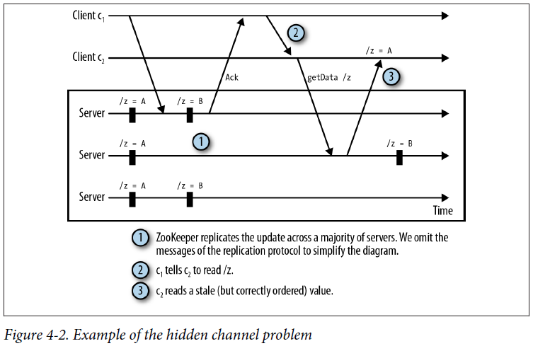

## Chapter 04: Dealing with State Change

- We talk about an event to denote the execution of an update to a given znode. A watch is a one-time trigger associated with a znode and a type of event (e.g., data is set in the znode, or the znode is deleted). When the watch is triggered by an event, it generates a notification. A notification is a message to the application client that registered the watch to inform this client of the event.

- To use the watch mechanism, we need to implement the Watcher interface, which consists of implementing a process method:
  ```java
  public void process(WatchedEvent event);
  ```

The WatchedEvent data structure contains the following:
	- The state of the ZooKeeper session (KeeperState): Disconnected, SyncConnected, AuthFailed, ConnectedReadOnly, SaslAuthenticated, or Expired
	- The event type (EventType): NodeCreated, NodeDeleted, NodeDataChanged, NodeChildrenChanged, or None
	- A znode path in the case that the watched event is not None

- Let’s take a quick look at a pretty common code pattern used in ZooKeeper applications:
	- (1) Make an asynchronous call.
	- (2) Implement a callback object and pass it to the asynchronous call.
	- (3) If the operation requires setting a watch, then implement a Watcher object and pass it on to the asynchronous call.

- Let’s now look at how we deal with changes of state in the master-worker example. Here is a list of tasks that require a component to wait for changes:
	- Mastership changes
	- Master waits for changes to the list of workers
	- Master waits for new tasks to assign
	- Worker waits for new task assignments
	- Client waits for task execution result

- An application client elects itself master by creating the /master znode (we call this “running for master”). If the znode already exists, the application client determines that it is not the primary master and returns. That implementation, however, does not tolerate a crash of the primary master. If the primary master crashes, the backup masters won’t know about it. Consequently, we need to set a watch on /master so that ZooKeeper notifies the client when /master is deleted (either explicitly or because the session of the primary master has expired).

- New workers may be added to the system and old workers may be decommissioned at any time. Workers might also crash before executing their assignments. To determine the workers that are available at any one time, we register new workers with ZooKeeper by adding a znode as a child of /workers. When a worker crashes or is simply removed from the system, its session expires, automatically causing its znode to be removed. Polite workers may also explicitly close their sessions without making ZooKeeper wait for a session expiration.

- A watch for a znode is set only if the operation is successful. If the ZooKeeper operation fails to be executed because the client has disconnected, then the application needs to call it again.

- Like waiting for changes to the list of workers, the primary master waits for new tasks to be added to /tasks. The master initially obtains the set of current tasks and sets a watch for changes to the set. The set is represented in ZooKeeper by the children of /tasks, and each child corresponds to a task. Once the master obtains tasks that have not been assigned, it selects a worker at random and assigns the task to the worker.

- One of the first steps a worker has to execute is to register itself with ZooKeeper. It does this by creating a znode under /workers.

We similarly create a znode /assign/worker-id so that the master can assign tasks to this worker. If we create /workers/worker-id before /assign/worker-id, we could fall into the situation in which the master tries to assign the task but cannot because the assigned parent’s znode has not been created yet. To avoid this situation, we need to create /assign/worker-id first. Moreover, the worker needs to set a watch on /assign/worker-id to receive a notification when a new task is assigned.

Once the worker has the list of tasks assigned to it, it fetches the tasks from /assign/worker-id and executes them.

- Suppose an application client has submitted a task. Now it needs to know when it has been executed and its status. Recall that once a worker executes a task, it creates a znode under /status.

- Multiop enables the execution of multiple ZooKeeper operations in a block atomically. The execution is atomic in the sense that either all operations in a multiop block succeed or all fail.

To use the multiop feature:
	- (1) Create an Op object to represent each ZooKeeper operation you intend to execute through a multiop call. ZooKeeper provides an Op implementation for each of the operations that change state: create, delete, and setData.
	- (2) Within the Op object, call a static method provided by Op for that operation.
	- (3) Add this Op object to an Iterable Java object, such as a list.
	- (4) Call multi on the list.

The following example illustrates this process:
  ```java
  Op deleteZnode(String z) {
    return Op.delete(z, -1);
  }
  ...
  List<OpResult> results = zk.multi(Arrays.asList(deleteZnode("/a/b"), deleteZnode("/a"));
  ```

- Transaction is a wrapper for multi with a simpler interface. We can create an instance of Transaction, add operations, and commit the transaction. The previous example rewritten using Transaction looks like this:
  ```java
  Transaction t = new Transaction();
  t.delete("/a/b", -1);
  t.delete("/a", -1);
  List<OpResult> results = t.commit();
  ```

	The commit call also has an asynchronous version that takes as input a MultiCallback object and a context object:
  ```java
  public void commit(MultiCallback cb, Object ctx);
  ```

- Another feature that multiop offers is the possibility of checking the version of a znode to enable operations over multiple znodes that read the state of ZooKeeper and write back some data—possibly a modification of what has been read. The version of the znode that is checked does not change, so this call enables a multiop that checks the version of a znode that is not modified. This feature is useful when the changes to one or more znodes are conditional upon the version of another znode.

- Say that in our master-worker example, the master needs to have the clients adding new tasks under a path that the master specifies. For example, the master could ask clients to create new tasks as children of /tasks-mid, where mid is the master identifier. The master stores this path as the data of the /master-path znode. A client that needs to add a new task first reads /master-path and picks its current version with Stat. Next, the client creates a new task znode under /tasks-mid as part of the a multiop call, and it also checks that the version of /master-path matches the one it has read.

	If the version of the znode in the given path does not match, the multi call fails. To illustrate, this is roughly how the code would look if we were to implement the example we have just discussed:
  ```java
  byte[] masterData = zk.getData("/master-path", false, stat);
  String parent = new String(masterData);
  ...
  zk.multi(Arrays.asList(Op.check("/master-path", stat.getVersion()), Op.create(, modify(z1Data),-1),
  ```

- It is undesirable from the application’s perspective to have clients accessing ZooKeeper every time they need to get the data for a given znode, the list of children of a znode, or anything else related to the ZooKeeper state. Instead, it is much more efficient to have clients cache values locally and use them at will. Once such values change, of course, you want ZooKeeper to notify the clients so they can update the caches.

- ZooKeeper clients always observe the same order of updates, even if they are connected to different servers. But it is possible for two clients to observe updates at different times. If they communicate outside ZooKeeper, the difference becomes apparent.

We call this a hidden channel because ZooKeeper doesn’t know about the clients’ extra communication.

To avoid reading stale data, we advise that applications use ZooKeeper for all communication related to the ZooKeeper state.

- Example of the hidden channel problem  
  

- Say that a znode /z is created or deleted to indicate that some configuration stored in ZooKeeper is invalid. Guaranteeing that clients are notified of the creation or deletion of /z before any actual change is made to the configuration is important to make sure that clients won’t read an invalid configuration.

- Liveness is about making sure that the system eventually makes progress. Notifications of new tasks and new workers are examples of events related to liveness. If a master is not notified of a new task, the task will never be executed. Not executing a submitted task constitutes absence of liveness, at least from the perspective of the client that submitted the task.

	This last example of atomic updates to a set of configuration znodes is different: it is about safety, not liveness. Reading the znodes while they are being updated might lead to a client reading an inconsistent configuration. The invalid znode makes sure that clients read the state only when a valid configuration is available.

- One issue to be aware of is that ZooKeeper triggers all watches set for a particular znode change when the change occurs. If there are 1,000 clients that have set a watch on a given znode with a call to exists, then 1,000 notifications will be sent out when the znode is created. A change to a watched znode might consequently generate a spike of notifications. Such a spike could affect, for example, the latency of operations submitted around the time of the spike. When possible, we recommend avoiding such a use of ZooKeeper in which a large number of clients watch for a change to a given znode. It is much better to have only a few clients watching any given znode at a time, and ideally at most one.