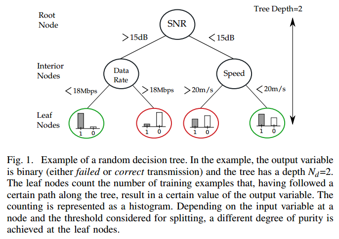

## RFRA: Random Forests Rate Adaptation for Vehicular Networks

Vehicular communications, however, are subject to fast topology and channel changes, as well as short connectivity spans.

Firstly, the movement of the nodes is limited in space by the length and width of the roads, and is regulated by traffic lights and speed limitations. Furthermore, moving cars do in general first approach a roadside unit and later leaves the communication area, which results in a certain pattern of the signal strength over time. Finally, GPS devices provide valuable information, such as position, speed, and acceleration of a node.

Our approach exploits SNR samples obained over a time window to characterize the propagation environment. We also use GPS information such as position and speed to increase the prediction accuracy.

As input feature vector we select the variables SNR, current speed, current position, as well as data rate employed. The output of Random Forests is the prediction if the packet transmitted under the conditions described by the input variables will be received successfully by the RSU.

The car combines SNR information (obtained from packets originated at the RSU) with speed and propagation distance to predict the success probability for each data rate and decide on the most appropriate rate for transmission.

The SNR samples collected over the last 25 ms are more important than the propagation distance. Interestingly, the speed is the input variable with the lowest relevance.

**Goodput** is defined as rate (in bits/seconds) of correctly received data frames excluding headers. Unless differently specified, we show the goodput measured by the RSU aggregated over all transmitting nodes. **Packet Error Rate (PER)** is the ratio of erroneous data packets to the total data packets transmitted. **Data Rate** refers to the average data rate (in bits/second) used by the transmitting nodes during a simulation run. **Accuracy** represents if the data rate has been precisely selected. To evaluate this, we obtain (off-line) the performance of every data rate as function of the SNR.