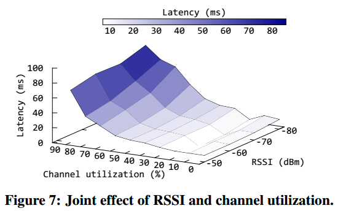

## Characterizing and Improving WiFi Latency in Large-Scale Operational Networks

The three most informative indicators for WiFi latency are channel utilization, the number of online devices, and the signal-to-noise-ratio (SNR), while the commonly considered RSSI used for AP selection is not.

SNMP data is a commonly-used data source for monitoring large-scale EWLANs. Most vendors provide a large range of useful SNMP data on their wireless controllers.

Radio factors include typical universal wireless performance metrics of APs and user devices, for example channel utilization, interference utilization, receiver/transmitter utilization, and #devices (per radio).

Channel utilization is the percentage of time used by all traffic of this channel; interference utilization is the part of channel utilization used by other 802.11 networks on the same channel; receiver/transmitter utilization is the percentage of time the AP receiver/transmitter is busy operating on packets; #devices (per radio) is the number of devices connected to the specific band of the AP.

A natural question is that since 5GHz provides a lower WiFi latency, why are dual-band devices nevertheless connecting to 2.4 GHz? The reason is that the device AP selection heavily depends on RSSI, and since 5 GHz signals attenuate faster, devices are biased towards 2.4 GHz. In contrast, RSSI is not a very important  factor for WiFi latency: good RSSI does not guarantee low WiFi latency. Moreover, when channel utilization exceeds 50%, even high RSSI cannot achieve low latency. Interestingly, we also find that AP vendors such as Cisco provide a mechanism to direct dual-band devices to the 5 GHz band by delaying probe responses of 2.4 GHz to make 5 GHz more attractive.

First, for channel utilization, the EX slow class only appears when channel utilization > 47.5%, end the EX fast class only appears when it ≤ 47.5%. Therefore, channel utilization greater than 47.5% can be deemed as the ***heavy load problem***.

Second, we observe that even when channel utilization is very slow, a large #devices can still impact WiFi latency. FOr example, the leftmost slow node occurs where channel utilization is ≤ 22.5 and #devices > 35.5. Previous studies suggest that this is caused by the ***local contention problem***: a large number of concurrent senders increase the data collision probability and the backoff waiting time, and decrease the achievable channel utilization.

Third, for SNR, we find that the split points of SNR nodes in the decision tree are from 21.5 dB to 25.5 dB. This suggests that SNR less than 20 dB is low, and could impact WiFi latency. Specifically, the fading and noise problem increases the bit error rate and thus increases the MAC layer frame retry times; or decreases the PHY rate and thus increases the transmission time, which both in turn inflate the WiFi latency.

## Why It Takes So Long to Connect to a WiFi Access Point

By tracking the WiFi network state transitions of these connection set-up processes, we discover anomaly transitions to *Disconnected* state cause the re-connecting. The further evidence shows that these are mainly caused by undesirable packet loss between the mobile devices and APs for the following reasons: variance of signal strength, WiFi interference, high load causing system respinse delay of mobile devices and APs.

We propose a machine learning based AP selection method by adding few easily obtained metrics as extra features including mobile device model, AP model, number of devices associated to the AP, hour in the day that a connection attempt happens.

It is noteworthy that obtaining IP address does not guarantee the access to Internet. For instance, some public APs have portal webpages which require users to identify themselves.

For half of the connection set-up processes whose *connection time costs* are below 15 seconds, the *DHCP* phase occupies more than 80%. Surprisingly, for connection set-up processes whose *connection time costs* are larger than 15 seconds, the *scan* phase consumes more time than the *DHCP* phase.

The scan time cost is large because many connection set-up processes re-enter the *Scanning* state multiple times.

The state *Scanning* transits to *Disconnected* because there is no response for mobile device' probe response. The state *Associating* transits to *Disconnected* because the AP does not reply with *Associating Response* packets.

These kinds of packet loss are caused by the following reasons: variation of RSSI of APs measured at mobile devices, WiFi interference or system (AP or mobile devices) processing delay caused timeout.

We use Relative Information Gain (RIG) and Kendall coefficient (Kendall) to quantitatively evaluate the relationship between the features and *connection time cost*.

It is noteworthy that our feature *number of devices* represents the number of devices currently associated with my AP, which is different from the *number of surrounding devices*.

There are two common roaming methods in enterprise networks: CAPWAP and HOKEY. Their main goals are reducing the extra time costs imported by EAP (Extensible Authentication Protocol) process, which are not included in home networks.

The final features we choose to train the *connection time cost* includes *hour of day*, *RSSI*, *mobile device model*, *AP model*, *Encrypted*.

To further make the model more friendly to use, we exclude *number of devices* from the feature set for two reasons: (1) *number of devices* is the AP-side information and is hard to obtain on the mobile devices. (2) After removing the *number of devices* from the feature set, our random forest model still has acceptable accuracy.